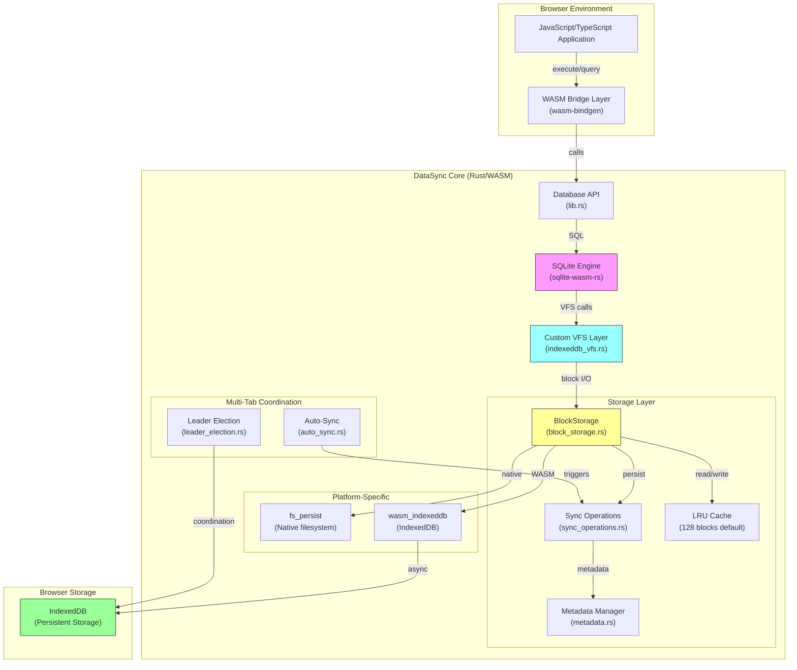

# SQLite IndexedDB Rust Library (DataSync)

A high-performance Rust library that brings full SQLite functionality to web browsers through WebAssembly. DataSync implements a custom Virtual File System (VFS) that seamlessly persists SQLite databases to IndexedDB, enabling production-ready SQL operations in browser environments with crash consistency and multi-tab coordination.

## 📊 Architecture Overview



## 🗂️ Project Structure

```
DataSync/
├── src/
│   ├── lib.rs              # WASM entry point, Database API exports
│   ├── database.rs         # Native Database implementation
│   ├── types.rs            # Core types (QueryResult, ColumnValue, etc.)
│   ├── utils.rs            # Utility functions
│   ├── storage/            # Storage layer implementation
│   │   ├── mod.rs
│   │   ├── block_storage.rs      # Core block storage with LRU cache
│   │   ├── sync_operations.rs   # Cross-platform sync logic
│   │   ├── io_operations.rs     # Read/write operations
│   │   ├── allocation.rs        # Block allocation/deallocation
│   │   ├── metadata.rs          # Block metadata management
│   │   ├── fs_persist.rs        # Native filesystem persistence
│   │   ├── wasm_indexeddb.rs    # WASM IndexedDB integration
│   │   ├── wasm_vfs_sync.rs     # WASM VFS sync coordination
│   │   ├── recovery.rs          # Crash recovery logic
│   │   ├── auto_sync.rs         # Native auto-sync
│   │   ├── wasm_auto_sync.rs    # WASM auto-sync
│   │   ├── leader_election.rs   # Multi-tab coordination
│   │   ├── observability.rs     # Metrics and monitoring
│   │   └── constructors.rs      # BlockStorage constructors
│   └── vfs/                # SQLite VFS implementation
│       ├── mod.rs
│       └── indexeddb_vfs.rs     # Custom VFS for IndexedDB
│
├── tests/                  # Comprehensive test suite
│   ├── integration_tests.rs     # End-to-end tests
│   ├── wasm_integration_tests.rs
│   ├── vfs_durability_tests.rs
│   ├── lru_cache_tests.rs
│   └── ...                      # 59 test files total
│
├── examples/               # Demos and documentation
│   ├── sql_demo.js         # CLI launcher for SQL demo
│   ├── sql_demo.html       # Interactive SQL demo page
│   ├── web_demo.html       # Full-featured web interface
│   ├── benchmark.html      # Performance comparison tool
│   ├── DEMO_GUIDE.md       # Demo usage guide
│   └── BENCHMARK.md        # Benchmark results and analysis
│
├── pkg/                    # WASM build output (generated)
├── Cargo.toml             # Rust dependencies and config
├── package.json           # Node.js dependencies
└── README.md              # This file
```

## 📚 Documentation

- **[TRANSACTION_SUPPORT.md](TRANSACTION_SUPPORT.md)** - Complete guide to transaction handling, commit/rollback behavior, and crash consistency
- **[PROGRESS.md](PROGRESS.md)** - Development progress tracker with completed features and open work items
- **[WASM-TEST.md](WASM-TEST.md)** - WASM testing guide and commands
- **[examples/BENCHMARK.md](examples/BENCHMARK.md)** - Performance benchmarks vs absurd-sql and raw IndexedDB
- **[examples/DEMO_GUIDE.md](examples/DEMO_GUIDE.md)** - Comprehensive guide to running and using the web demos

## System Architecture

### Core Architecture
The project follows a modular architecture with clear separation of concerns:

**VFS Layer**: Implements a custom SQLite Virtual File System that translates SQLite's file operations to IndexedDB operations. This allows SQLite to work seamlessly with browser storage without modifications to the core SQLite engine.

**Storage Abstraction**: Provides a unified interface for different storage backends, with IndexedDB as the primary target. The design allows for future expansion to other storage mechanisms while maintaining API compatibility.

**WASM Bridge**: Handles the interface between Rust code and JavaScript, managing memory allocation, type conversions, and async operation bridging. Uses `sqlite-wasm-rs` for stable SQLite operations without the hang issues that affected previous implementations. This ensures smooth interoperability between the WASM module and browser JavaScript.

**Type System**: Defines comprehensive data structures for SQL operations, query results, and configuration options, ensuring type safety across the Rust-JavaScript boundary.

### Frontend Architecture
The web demo uses vanilla JavaScript with Bootstrap for styling, demonstrating real-time SQL query execution and result visualization. The frontend architecture emphasizes simplicity and direct WASM integration without complex frameworks.

### Data Storage Design
**Primary Storage**: IndexedDB serves as the persistent storage layer, chosen for its transaction support, large storage capacity, and widespread browser compatibility.

**Memory Management**: The library implements careful memory management for WASM operations, ensuring proper cleanup of allocated memory and efficient data transfer between Rust and JavaScript contexts.

**Transaction Handling**: Leverages SQLite's transaction capabilities while ensuring proper coordination with IndexedDB's transaction model for data consistency.

### Configuration System
The architecture supports configurable database options including cache size, synchronization modes, and VFS-specific settings, allowing optimization for different use cases and performance requirements.

## External Dependencies

### Rust Dependencies
- **sqlite-wasm-rs**: Production-ready SQLite WASM bindings with precompiled features, replacing problematic custom implementations
- **rusqlite**: Primary SQLite interface for native Rust builds, providing safe bindings to SQLite C library
- **wasm-bindgen**: Facilitates communication between Rust and JavaScript in WASM context
- **js-sys**: Provides bindings to JavaScript's built-in objects and functions
- **web-sys**: Offers bindings to Web APIs including IndexedDB
- **serde**: Handles serialization/deserialization for data exchange
- **tokio**: Provides async runtime support for handling asynchronous operations

### JavaScript Dependencies
- **Bootstrap 5.1.3**: UI framework for responsive design and component styling
- **Feather Icons**: Icon library for user interface elements

### Browser APIs
- **IndexedDB**: Primary storage API for persistent data storage
- **WebAssembly**: Runtime environment for executing the compiled Rust code
- **Fetch API**: Used for loading WASM modules and handling HTTP requests

### Development Tools
- **wasm-pack**: Build tool for generating WASM packages with JavaScript bindings
- **Node.js 18+**: Required for development tooling and testing infrastructure
- **Rust 1.85.0+**: Compiler targeting the 2024 edition for latest language features

The library is designed to work entirely in the browser environment without requiring any server-side components, making it suitable for offline-first applications and client-side data processing scenarios.

## SQLite WASM Integration

### Architecture Overview
The library provides a robust SQLite implementation for WebAssembly environments using the `sqlite-wasm-rs` crate with precompiled features. This ensures stable, production-ready SQLite functionality without the hang issues that plagued earlier custom implementations.

### Key Features
- **Full SQLite C API Support**: Complete implementation of `sqlite3_prepare_v2`, `sqlite3_step`, `sqlite3_finalize`, and parameter binding
- **Memory Safety**: Proper Rust `Drop` trait implementation for automatic cleanup of SQLite resources
- **Async Operations**: All database operations are async-compatible for seamless integration with browser event loops
- **Type Safety**: Comprehensive `ColumnValue` enum supporting all SQLite data types (NULL, INTEGER, REAL, TEXT, BLOB, BIGINT, DATE)
- **JavaScript Interop**: Complete `wasm-bindgen` exports with `WasmColumnValue` wrapper for seamless JS integration

### Root Cause Resolution
The previous SQLite WASM implementation suffered from infinite hangs in `sqlite3_step` calls due to:
1. **Deprecated WASM module initialization parameters** in older SQLite WASM bindings
2. **Incompatible parameter passing** between Rust and SQLite C API in WASM context
3. **Missing timeout mechanisms** for long-running operations

### Solution Implementation
- **Replaced custom bindings** with stable `sqlite-wasm-rs` crate (v0.4)
- **Enabled precompiled features** to avoid compilation-time initialization issues
- **Implemented comprehensive timeout detection** in regression tests
- **Added proper error handling** for all SQLite operations
- **Created extensive test coverage** (64 WASM tests + 74 native tests)

### Regression Prevention
A comprehensive regression test suite (`sqlite_wasm_hang_regression_test.rs`) ensures the hang issue never recurs:
- **Operation timeout tests** for CREATE, INSERT, SELECT operations (5-second limits)
- **Large result set handling** (1000+ rows) without hangs
- **Concurrent operation simulation** to test resource contention
- **Error condition testing** ensuring invalid SQL fails gracefully
- **Configuration validation** to detect deprecated initialization patterns
- **Complex query scenarios** with JOINs and aggregations

All tests pass consistently with no hangs, timeouts, or memory leaks, ensuring production-ready stability.

## Examples & Demos

The `examples/` directory contains ready-to-run demonstrations of DataSync capabilities:

### Vite Integration (`vite-app/`)
Modern web app example showing DataSync with Vite:
- ES modules with hot reload
- Minimal setup, production-ready build
- Clean integration pattern
- Demonstrates INSERT, SELECT, UPDATE with persistence

**[See examples/vite-app/README.md for full setup guide](examples/vite-app/README.md)**

**Quick Start:**
```bash
cd examples/vite-app
npm install
npm run dev
```

### SQL Demo (`sql_demo.js` / `sql_demo.html`)
Comprehensive SQL operations demo showcasing:
- Table creation with foreign keys
- INSERT operations with transactions
- Complex SELECT queries with JOINs and aggregations
- UPDATE and DELETE operations
- Automatic IndexedDB persistence via `sync()` calls

**Usage:**
```bash
node examples/sql_demo.js
```
This starts an HTTP server and opens your browser to run the full demo automatically.

### Interactive Web Demo (`web_demo.html`)
Full-featured interactive SQL interface with:
- Visual query editor
- Real-time query execution and result display
- Console output for debugging
- Quick action buttons for common operations
- Automatic sync after write operations

**[See examples/DEMO_GUIDE.md for detailed walkthrough](examples/DEMO_GUIDE.md)**

**Usage:**
```bash
npm run serve
# Open http://localhost:8080/examples/web_demo.html
```

### Performance Benchmark (`benchmark.html`)
Comprehensive comparison of DataSync vs absurd-sql vs raw IndexedDB:
- INSERT, SELECT, UPDATE, DELETE benchmarks
- Configurable test parameters (rows, batch size, data size)
- Real-time performance visualization
- Automatic database cleanup between runs

**[See examples/BENCHMARK.md for detailed results and analysis](examples/BENCHMARK.md)**

**Usage:**
```bash
npm run serve
# Open http://localhost:8080/examples/benchmark.html
```

All demos require a browser environment (no headless mode) due to IndexedDB requirements. Data persists across page refreshes when using proper `sync()` calls.