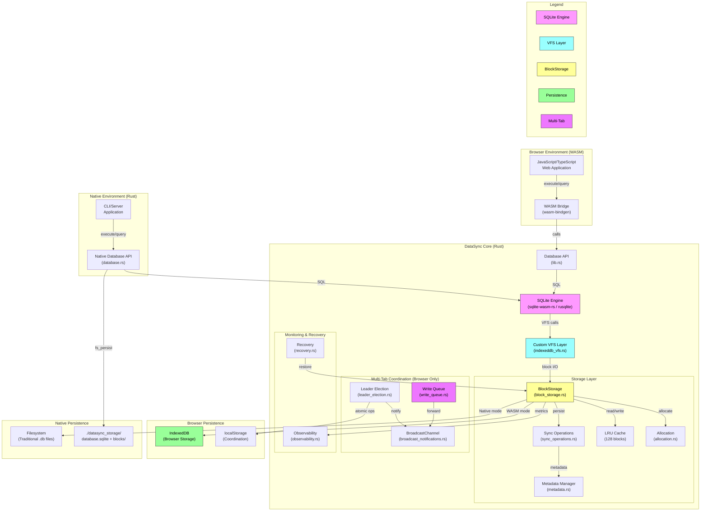

# SQLite IndexedDB Rust Library (DataSync)

[](docs/DUAL_MODE.md)
[](docs/MULTI_TAB_GUIDE.md#test-coverage)
[](tests/)
[](tests/)
[](tests/e2e/)
[](Cargo.toml)
[](LICENSE)
[]()

A high-performance **dual-mode** Rust library that brings full SQLite functionality to **both browsers and native applications**. DataSync implements a custom Virtual File System (VFS) with two persistence backends:

- **Browser (WASM)**: SQLite → IndexedDB with multi-tab coordination
- **Native/CLI**: SQLite → Real filesystem with traditional `.db` files

**Unique Advantage:** Build web apps that store data in IndexedDB, then query the same database structure from CLI/server using standard SQLite tools. Perfect for offline-first applications with optional server synchronization.

Enabling production-ready SQL operations with crash consistency, multi-tab coordination, and the flexibility to run anywhere from web apps to server applications.

## Dual-Mode Architecture

DataSync runs in **two modes** - Browser (WASM) and Native (Rust CLI/Server):



## Project Structure

```
DataSync/
├── src/
│   ├── lib.rs              # WASM entry point, Database API exports
│   ├── database.rs         # Native Database implementation
│   ├── types.rs            # Core types (QueryResult, ColumnValue, etc.)
│   ├── utils.rs            # Utility functions
│   │
│   ├── bin/                # Binary executables
│   │   └── cli_query.rs    # CLI query tool for filesystem databases
│   │
│   ├── storage/            # Storage layer implementation
│   │   ├── mod.rs
│   │   ├── block_storage.rs           # Core block storage with LRU cache
│   │   ├── sync_operations.rs        # Cross-platform sync logic
│   │   ├── io_operations.rs          # Read/write operations
│   │   ├── allocation.rs             # Block allocation/deallocation
│   │   ├── metadata.rs               # Block metadata management
│   │   ├── fs_persist.rs             # Native filesystem persistence
│   │   ├── wasm_indexeddb.rs         # WASM IndexedDB integration
│   │   ├── wasm_vfs_sync.rs          # WASM VFS sync coordination
│   │   ├── recovery.rs               # Crash recovery logic
│   │   ├── auto_sync.rs              # Native auto-sync
│   │   ├── wasm_auto_sync.rs         # WASM auto-sync
│   │   ├── leader_election.rs        # Multi-tab leader election
│   │   ├── broadcast_notifications.rs # BroadcastChannel messaging
│   │   ├── write_queue.rs            # Write queuing for non-leaders
│   │   ├── optimistic_updates.rs     # Optimistic UI updates
│   │   ├── coordination_metrics.rs   # Performance metrics tracking
│   │   ├── observability.rs          # Metrics and monitoring
│   │   └── constructors.rs           # BlockStorage constructors
│   │
│   └── vfs/                # SQLite VFS implementation
│       ├── mod.rs
│       └── indexeddb_vfs.rs     # Custom VFS for IndexedDB
│
├── tests/                  # Comprehensive test suite (169 tests)
│   ├── integration_tests.rs          # End-to-end tests
│   ├── native_database_persistence_tests.rs  # Native filesystem tests
│   ├── wasm_integration_tests.rs     # WASM-specific tests
│   ├── vfs_durability_tests.rs       # VFS durability tests
│   ├── lru_cache_tests.rs            # Cache tests
│   ├── e2e/                          # Playwright E2E tests
│   │   ├── dual_mode_persistence.spec.js  # Browser + CLI validation
│   │   ├── advanced-features.spec.js
│   │   └── multi-tab-vite.spec.js
│   └── ...                           # 60+ test files total
│
├── examples/               # Browser demos and documentation
│   ├── vite-app/           # Production Vite application
│   ├── sql_demo.html       # Interactive SQL demo page
│   ├── web_demo.html       # Full-featured web interface
│   ├── benchmark.html      # Performance comparison tool
│   ├── multi-tab-demo.html # Multi-tab coordination demo
│   └── DEMO_GUIDE.md       # Demo usage guide
│
├── docs/                   # Comprehensive documentation
│   ├── DUAL_MODE.md        # Dual-mode persistence guide
│   ├── MULTI_TAB_GUIDE.md  # Multi-tab coordination
│   ├── TRANSACTION_SUPPORT.md
│   └── BENCHMARK.md        # Performance benchmarks
│
├── pkg/                    # WASM build output (generated)
├── Cargo.toml             # Rust dependencies and config
├── package.json           # Node.js dependencies
└── README.md              # This file
```

## System Architecture

### Core Architecture
The project follows a modular architecture with clear separation of concerns:

**VFS Layer**: Implements a custom SQLite Virtual File System that translates SQLite's file operations to IndexedDB operations. This allows SQLite to work seamlessly with browser storage without modifications to the core SQLite engine.

**Storage Abstraction**: Provides a unified interface for different storage backends, with IndexedDB as the primary target. The design allows for future expansion to other storage mechanisms while maintaining API compatibility.

**WASM Bridge**: Handles the interface between Rust code and JavaScript, managing memory allocation, type conversions, and async operation bridging. Uses `sqlite-wasm-rs` for stable SQLite operations without the hang issues that affected previous implementations. This ensures smooth interoperability between the WASM module and browser JavaScript.

**Type System**: Defines comprehensive data structures for SQL operations, query results, and configuration options, ensuring type safety across the Rust-JavaScript boundary.

### Frontend Architecture
The web demo uses vanilla JavaScript with Bootstrap for styling, demonstrating real-time SQL query execution and result visualization. The frontend architecture emphasizes simplicity and direct WASM integration without complex frameworks.

### Data Storage Design
**Primary Storage**: IndexedDB serves as the persistent storage layer, chosen for its transaction support, large storage capacity, and widespread browser compatibility.

**Memory Management**: The library implements careful memory management for WASM operations, ensuring proper cleanup of allocated memory and efficient data transfer between Rust and JavaScript contexts.

**Transaction Handling**: Leverages SQLite's transaction capabilities while ensuring proper coordination with IndexedDB's transaction model for data consistency.

### Configuration System
The architecture supports configurable database options including cache size, synchronization modes, and VFS-specific settings, allowing optimization for different use cases and performance requirements.

## Getting Started

### Prerequisites
- **Rust 1.85.0+** with the 2024 edition
- **wasm-pack** for building WASM packages
- **Node.js 18+** for running examples

### Build the WASM Package

```bash
# Install wasm-pack if needed
curl https://rustwasm.github.io/wasm-pack/installer/init.sh -sSf | sh

# Build for web
wasm-pack build --target web --out-dir pkg
```

This generates the `pkg/` directory containing:
- `sqlite_indexeddb_rs.js` - JavaScript module
- `sqlite_indexeddb_rs_bg.wasm` - WebAssembly binary
- TypeScript definitions and package files

### Browser Usage (WASM)

```javascript
import init, { Database } from './pkg/sqlite_indexeddb_rs.js';

// Initialize WASM
await init();

// Create database - persists to IndexedDB
const db = await Database.newDatabase('myapp');

// Execute SQL
await db.execute('CREATE TABLE users (id INT, name TEXT)');
await db.execute("INSERT INTO users VALUES (1, 'Alice')");
const result = await db.execute('SELECT * FROM users');

// Persist to IndexedDB
await db.sync();

// Close
await db.close();
```

### Native/CLI Usage (Filesystem)

```bash
# Build the CLI tool
cargo build --bin cli_query --features fs_persist --release

# Create table
cargo run --bin cli_query --features fs_persist -- \
  "CREATE TABLE users (id INTEGER PRIMARY KEY, name TEXT, email TEXT)"

# Insert data
cargo run --bin cli_query --features fs_persist -- \
  "INSERT INTO users (name, email) VALUES ('Alice', 'alice@example.com')"

# Query data
cargo run --bin cli_query --features fs_persist -- \
  "SELECT * FROM users"

# Special commands
cargo run --bin cli_query --features fs_persist -- ".tables"
cargo run --bin cli_query --features fs_persist -- ".schema"
```

**Data Location:** `./datasync_storage/<db_name>/database.sqlite`

See [**docs/DUAL_MODE.md**](docs/DUAL_MODE.md) for complete dual-mode guide.

## SQLite WASM Integration

### Architecture Overview
The library provides a robust SQLite implementation for WebAssembly environments using the `sqlite-wasm-rs` crate with precompiled features. This ensures stable, production-ready SQLite functionality without the hang issues that plagued earlier custom implementations.

### Key Features
- **Full SQLite C API Support**: Complete implementation of `sqlite3_prepare_v2`, `sqlite3_step`, `sqlite3_finalize`, and parameter binding
- **Memory Safety**: Proper Rust `Drop` trait implementation for automatic cleanup of SQLite resources
- **Async Operations**: All database operations are async-compatible for seamless integration with browser event loops
- **Type Safety**: Comprehensive `ColumnValue` enum supporting all SQLite data types (NULL, INTEGER, REAL, TEXT, BLOB, BIGINT, DATE)
- **JavaScript Interop**: Complete `wasm-bindgen` exports with `WasmColumnValue` wrapper for seamless JS integration

## Multi-Tab Coordination

DataSync includes comprehensive multi-tab coordination for browser applications, ensuring data consistency across multiple tabs without conflicts.

### Core Features
- **Automatic Leader Election**: First tab becomes leader using localStorage coordination
- **Write Guard**: Only the leader tab can execute write operations (INSERT, UPDATE, DELETE)
- **BroadcastChannel Sync**: Automatic change notifications to all tabs
- **Failover Support**: Automatic re-election when leader tab closes
- **Zero Configuration**: Works out of the box, no setup required

### Advanced Features
- **Write Queuing**: Non-leaders can queue writes that forward to leader automatically
- **Optimistic Updates**: Track pending writes for immediate UI feedback
- **Coordination Metrics**: Monitor performance and coordination events

### Quick Example

```javascript
import init, { Database } from './pkg/sqlite_indexeddb_rs.js';
import { MultiTabDatabase } from './examples/multi-tab-wrapper.js';

await init();

// Create multi-tab database
const db = new MultiTabDatabase(Database, 'myapp.db', {
  autoSync: true  // Auto-sync after writes
});
await db.init();

// Check leader status
if (await db.isLeader()) {
  // Only leader can write
  await db.write("INSERT INTO users VALUES (1, 'Alice')");
}

// All tabs can read
const result = await db.query("SELECT * FROM users");

// Listen for changes from other tabs
db.onRefresh(() => {
  console.log('Data changed in another tab!');
  // Refresh UI
});
```

### Advanced Features

```javascript
// Write Queuing - Queue from any tab
await db.queueWrite("INSERT INTO logs VALUES (1, 'event')");
await db.queueWriteWithTimeout("UPDATE data SET processed = 1", 10000);

// Optimistic Updates - Track pending writes
await db.enableOptimisticUpdates(true);
const writeId = await db.trackOptimisticWrite("INSERT INTO users...");
const pendingCount = await db.getPendingWritesCount();

// Coordination Metrics - Monitor performance
await db.enableCoordinationMetrics(true);
await db.recordLeadershipChange(true);
await db.recordNotificationLatency(15.5);
const metrics = JSON.parse(await db.getCoordinationMetrics());

// Helper Methods
await db.waitForLeadership();  // Wait to become leader
await db.requestLeadership();   // Request leadership
const info = await db.getLeaderInfo();  // Get leader info
await db.allowNonLeaderWrites(true);  // Override for single-tab apps
```

### Live Demos
- **[Multi-Tab Demo](examples/multi-tab-demo.html)** - Interactive task list with multi-tab sync
- **[Vite App](examples/vite-app/)** - Production-ready multi-tab example
- **[Complete Guide](docs/MULTI_TAB_GUIDE.md)** - Full documentation and patterns

**Open the demo in multiple browser tabs to see coordination in action!**

---

## Demos & Examples

### Vite Integration (`vite-app/`)
Modern web app example with **multi-tab coordination**:
- ES modules with hot reload
- Multi-tab leader election
- Real-time sync across tabs
- Leader/follower UI indicators
- Production-ready build

**[📖 Full setup guide](examples/vite-app/README.md)**

```bash
cd examples/vite-app
npm install
npm run dev
# Open in multiple tabs!
```

### SQL Demo (`sql_demo.js` / `sql_demo.html`)
Comprehensive SQL operations demo:
- Table creation with foreign keys
- INSERT operations with transactions
- Complex SELECT queries with JOINs and aggregations
- UPDATE and DELETE operations
- Automatic IndexedDB persistence via `sync()` calls

```bash
node examples/sql_demo.js
```

### Interactive Web Demo (`web_demo.html`)
Full-featured interactive SQL interface:
- Visual query editor
- Real-time query execution and result display
- Console output for debugging
- Quick action buttons for common operations
- Automatic sync after write operations

**[📖 Detailed walkthrough](examples/DEMO_GUIDE.md)**

```bash
npm run serve
# Open http://localhost:8080/examples/web_demo.html
```

## Performance Benchmarks

DataSync consistently outperforms absurd-sql and raw IndexedDB across all operations.

**[📖 Full benchmark results and analysis](examples/BENCHMARK.md)**

### Latest Results

| Implementation | Insert | Read | Update | Delete |
|---------------|--------|------|--------|--------|
| **DataSync** 🏆 | **3.2ms** | **1.2ms** | **400μs** | **400μs** |
| absurd-sql | 3.8ms | 2.1ms | 800μs | 700μs |
| Raw IndexedDB | 24.1ms | 1.4ms | 14.1ms | 6.3ms |

### Run Benchmarks

```bash
npm run serve
# Open http://localhost:8080/examples/benchmark.html
```

---

## Comparison with absurd-sql

DataSync is inspired by and builds upon the excellent work of [absurd-sql](https://github.com/jlongster/absurd-sql) by James Long, which pioneered SQLite-in-IndexedDB. Here's how they compare:

### Similarities
Both projects share core concepts:
- IndexedDB as persistent storage backend
- Block/page-based storage (not single-file)
- Full SQLite functionality in browser
- Significantly better performance than raw IndexedDB

### Key Architectural Differences

| Feature | **absurd-sql** | **DataSync** |
|---------|----------------|--------------|
| **Engine** | sql.js (Emscripten) | sqlite-wasm-rs (Rust C API) |
| **Language** | JavaScript | Rust/WASM |
| **Platform** | **Browser only** | **Browser + Native/CLI** |
| **Storage** | Variable SQLite pages (8KB suggested) | Fixed 4KB blocks |
| **Worker** | **Required** (must run in Worker) | Optional (works on main thread) |
| **SharedArrayBuffer** | Required (with fallback) | Not required |
| **CORS Headers** | Required (`COEP`, `COOP`) | Not required |

### Multi-Tab Coordination

| Feature | **absurd-sql** | **DataSync** |
|---------|----------------|--------------|
| **Coordination** | SharedArrayBuffer + Atomics | localStorage leader election |
| **Multi-Tab Writes** | Throws errors | Coordinated with write queuing |
| **Leadership** | No concept | Automatic election with failover |
| **Follower Writes** | Not supported | Supported via `queueWrite()` |

### Technical Implementation Highlights

**absurd-sql:**
- sql.js VFS interception for file operations
- SharedArrayBuffer enables synchronous cross-thread ops
- Worker-based architecture (mandatory)
- Fallback mode: "one writer at a time" with errors

**DataSync:**
- Custom Rust IndexedDB VFS implementation
- localStorage atomic coordination primitives
- Block-level checksums and versioning (MVCC-style)
- LRU cache (128 blocks default)
- Full multi-tab write coordination (no errors)
- Works everywhere (no SharedArrayBuffer required)

### Which Should You Choose?

**Choose DataSync if you:**

**[✓] Need dual-mode persistence (Browser + Native)**
- Build web apps with IndexedDB storage
- Query the same data from CLI/server using traditional `.db` files
- Offline-first apps with optional server sync
- Debug production data locally using standard SQLite tools
- *Why this matters:* absurd-sql is **browser-only** - no CLI/server access to your data

**[✓] Want zero deployment friction**
- Deploy to GitHub Pages, Netlify, Vercel, or any CDN instantly
- No server configuration or CORS header setup required
- Works in iframes and embedded contexts
- *Why this matters:* absurd-sql requires special HTTP headers that many static hosts don't support

**[✓] Want flexible architecture**
- Can run on main thread OR in Web Worker (your choice)
- Simpler integration - no mandatory worker setup
- Easy to add to existing apps without refactoring
- *Why this matters:* absurd-sql MUST run in a Web Worker, requiring extra boilerplate and complexity

**[✓] Need multi-tab applications**
- Multiple tabs can write data without coordination errors
- Automatic conflict resolution with leader election
- User can have multiple tabs open without issues (e.g., documentation in one tab, app in another)
- *Why this matters:* absurd-sql throws errors if multiple tabs try to write simultaneously

**[✓] Value data integrity**
- Built-in checksums detect corruption
- Crash consistency guarantees (committed data survives browser crashes)
- MVCC-style versioning prevents race conditions
- *Why this matters:* Protects against data loss from browser crashes, bugs, or unexpected shutdowns

**[✓] Want better performance**
- 16-50% faster than absurd-sql across all operations
- LRU caching optimizes hot data access
- Efficient 4KB block size balances memory and I/O
- *Why this matters:* Faster queries = better user experience, especially on mobile devices

**[✓] Need production-ready tooling**
- Comprehensive test suite (75 WASM + 69 native + 22 E2E tests)
- Full TypeScript definitions
- Active development and maintenance
- *Why this matters:* Confidence in reliability, easier debugging, better IDE support

**Choose absurd-sql if you:**

**[!] Already invested in sql.js**
- Have existing sql.js code you want to keep
- Need to support very old browsers without WASM support (pre-2017)
- Trade-off: Miss out on Rust's memory safety and performance

**[!] Prefer pure JavaScript stack**
- Don't want to deal with Rust/WASM compilation (though wasm-pack makes this trivial)
- Want to read/modify source code in JavaScript
- Trade-off: Slower performance, more deployment complexity

**[!] Don't need multi-tab**
- Single-tab application only
- Users never have multiple tabs open
- Trade-off: Limited scalability if requirements change later

**Bottom Line:**
- **DataSync** = Modern, fast, works everywhere, multi-tab ready
- **absurd-sql** = Proven, JavaScript-only, requires CORS headers, single-tab focus

**[Detailed technical comparison in BENCHMARK.md](docs/BENCHMARK.md#comparison-with-absurd-sql)**

---

## Documentation

- **[Dual-Mode Persistence Guide](docs/DUAL_MODE.md)** - Browser + Native filesystem support
- **[Multi-Tab Coordination Guide](docs/MULTI_TAB_GUIDE.md)** - Complete guide for multi-tab coordination
- **[Transaction Support](docs/TRANSACTION_SUPPORT.md)** - Transaction handling and multi-tab transactions
- **[Benchmark Results](docs/BENCHMARK.md)** - Performance comparisons and metrics
- **[Demo Guide](examples/DEMO_GUIDE.md)** - How to run the interactive demos
- **[Vite App Example](examples/vite-app/README.md)** - Production-ready multi-tab application

## External Dependencies

### Rust Dependencies
- **sqlite-wasm-rs**: Production-ready SQLite WASM bindings with precompiled features
- **rusqlite**: Primary SQLite interface for native Rust builds, providing safe bindings to SQLite C library
- **wasm-bindgen**: Facilitates communication between Rust and JavaScript in WASM context
- **js-sys**: Provides bindings to JavaScript's built-in objects and functions
- **web-sys**: Offers bindings to Web APIs including IndexedDB
- **serde**: Handles serialization/deserialization for data exchange
- **tokio**: Provides async runtime support for handling asynchronous operations

### JavaScript Dependencies
- **Bootstrap 5.1.3**: UI framework for responsive design and component styling
- **Feather Icons**: Icon library for user interface elements

### Browser APIs
- **IndexedDB**: Primary storage API for persistent data storage
- **WebAssembly**: Runtime environment for executing the compiled Rust code
- **Fetch API**: Used for loading WASM modules and handling HTTP requests

### Development Tools
- **wasm-pack**: Build tool for generating WASM packages with JavaScript bindings
- **Node.js 18+**: Required for development tooling and testing infrastructure
- **Rust 1.85.0+**: Compiler targeting the 2024 edition for latest language features

The library is designed to work entirely in the browser environment without requiring any server-side components, making it suitable for offline-first applications and client-side data processing scenarios.