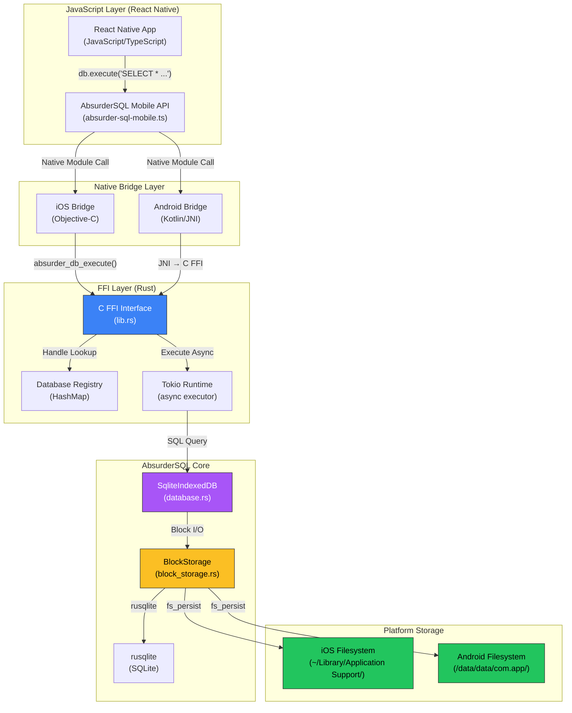

# Design Documentation
## AbsurderSQL Mobile: React Native FFI Integration

**Version:** 1.0  
**Date:** October 17, 2025  
**Status:** Design

---

## Table of Contents
1. [System Overview](#system-overview)
2. [Architecture](#architecture)
3. [Component Design](#component-design)
4. [Data Flow](#data-flow)
5. [API Design](#api-design)
6. [Storage Design](#storage-design)
7. [Error Handling](#error-handling)
8. [Performance Considerations](#performance-considerations)
9. [Security](#security)
10. [Build System](#build-system)

---

## System Overview

### Architecture Diagram



### Key Design Principles

1. **Single Source of Truth**: Reuse 95% of existing AbsurderSQL core (`src/database.rs`, `src/storage/`)
2. **Thin FFI Layer**: Minimal C ABI surface area; complex logic stays in Rust
3. **Memory Safety**: Explicit ownership via handles; no raw pointer passing to JavaScript
4. **Platform Parity**: Same behavior on iOS and Android
5. **Progressive Enhancement**: Start with core features; add advanced features incrementally

---

## Architecture

### Layered Architecture

```
┌─────────────────────────────────────────────────────────┐
│  React Native Application (JavaScript/TypeScript)       │
│  - UI Components                                         │
│  - Business Logic                                        │
│  - State Management                                      │
└─────────────────────────────────────────────────────────┘
                           ↓
┌─────────────────────────────────────────────────────────┐
│  AbsurderSQL Mobile API (TypeScript)                     │
│  - Database Class                                        │
│  - Promise-based API                                     │
│  - Error Translation                                     │
└─────────────────────────────────────────────────────────┘
                           ↓
┌──────────────────────┬──────────────────────────────────┐
│  iOS Bridge          │  Android Bridge                  │
│  (Objective-C)       │  (Kotlin + JNI)                  │
│  - RCTBridgeModule   │  - ReactContextBaseJavaModule    │
│  - Promise Handling  │  - Promise Handling              │
└──────────────────────┴──────────────────────────────────┘
                           ↓
┌─────────────────────────────────────────────────────────┐
│  C FFI Layer (Rust)                                      │
│  - absurder_db_new()                                     │
│  - absurder_db_execute()                                 │
│  - absurder_db_close()                                   │
│  - absurder_free_string()                                │
└─────────────────────────────────────────────────────────┘
                           ↓
┌─────────────────────────────────────────────────────────┐
│  AbsurderSQL Core (Existing Rust Codebase)              │
│  - database.rs (SqliteIndexedDB)                         │
│  - storage/* (BlockStorage, fs_persist, etc.)            │
│  - vfs/* (IndexedDB VFS - unused on mobile)              │
└─────────────────────────────────────────────────────────┘
                           ↓
┌─────────────────────────────────────────────────────────┐
│  Platform Storage (Filesystem)                           │
│  iOS: ~/Library/Application Support/absurdersql/         │
│  Android: /data/data/com.app/databases/absurdersql/      │
└─────────────────────────────────────────────────────────┘
```

---

## Component Design

### 1. C FFI Layer (`absurder-sql-mobile/src/lib.rs`)

**Responsibility:** Expose C ABI functions callable from iOS and Android

**Key Components:**

```rust
// Global database registry (thread-safe)
static DB_REGISTRY: Lazy<Arc<Mutex<HashMap<u64, SqliteIndexedDB>>>> = ...;

// C ABI Functions
#[no_mangle]
pub unsafe extern "C" fn absurder_db_new(name: *const c_char) -> u64;

#[no_mangle]
pub unsafe extern "C" fn absurder_db_execute(
    handle: u64,
    sql: *const c_char,
) -> *mut c_char;

#[no_mangle]
pub unsafe extern "C" fn absurder_db_close(handle: u64);

#[no_mangle]
pub unsafe extern "C" fn absurder_free_string(s: *mut c_char);

#[no_mangle]
pub unsafe extern "C" fn absurder_db_export(
    handle: u64,
    path: *const c_char,
) -> bool;

#[no_mangle]
pub unsafe extern "C" fn absurder_db_import(
    handle: u64,
    path: *const c_char,
) -> bool;
```

**Design Decisions:**
- **Handle-based API**: Return opaque `u64` handles instead of raw pointers (safer)
- **JSON serialization**: Query results serialized to JSON strings (cross-language compatibility)
- **Blocking calls**: Use Tokio runtime inside FFI to make async Rust functions synchronous for C
- **Memory management**: Caller must free strings with `absurder_free_string()`

### 2. iOS Bridge (`ios/AbsurderSQLBridge.m`)

**Responsibility:** Wrap C FFI in React Native module for iOS

```objc
@interface AbsurderSQLBridge : NSObject <RCTBridgeModule>
@property (nonatomic, assign) void *dbHandle;
@end

@implementation AbsurderSQLBridge

RCT_EXPORT_MODULE();

RCT_EXPORT_METHOD(createDatabase:(NSString *)name
                  resolver:(RCTPromiseResolveBlock)resolve
                  rejecter:(RCTPromiseRejectBlock)reject) {
    const char *cName = [name UTF8String];
    uint64_t handle = absurder_db_new(cName);
    
    if (handle == 0) {
        reject(@"CREATE_ERROR", @"Failed to create database", nil);
    } else {
        self.dbHandle = (void *)handle;
        resolve(@(YES));
    }
}

RCT_EXPORT_METHOD(execute:(NSString *)sql
                  resolver:(RCTPromiseResolveBlock)resolve
                  rejecter:(RCTPromiseRejectBlock)reject) {
    const char *cSql = [sql UTF8String];
    char *resultJson = absurder_db_execute((uint64_t)self.dbHandle, cSql);
    
    if (resultJson == NULL) {
        reject(@"EXEC_ERROR", @"Query failed", nil);
        return;
    }
    
    NSString *jsonStr = [NSString stringWithUTF8String:resultJson];
    absurder_free_string(resultJson);
    
    NSData *data = [jsonStr dataUsingEncoding:NSUTF8StringEncoding];
    NSDictionary *result = [NSJSONSerialization JSONObjectWithData:data options:0 error:nil];
    
    resolve(result);
}

@end
```

**Design Decisions:**
- **Instance-level handle**: Store database handle in bridge instance (supports multiple databases)
- **Promise-based**: All methods return Promises for async JavaScript API
- **Error handling**: Use React Native's reject() for errors
- **Memory management**: Free C strings immediately after conversion

### 3. Android Bridge (`android/.../AbsurderSQLModule.kt`)

**Responsibility:** Wrap C FFI in React Native module for Android

```kotlin
class AbsurderSQLModule(reactContext: ReactApplicationContext) :
    ReactContextBaseJavaModule(reactContext) {
    
    private var dbHandle: Long = 0
    
    companion object {
        init {
            System.loadLibrary("absurder_sql_mobile")
        }
    }
    
    override fun getName() = "AbsurderSQL"
    
    @ReactMethod
    fun createDatabase(name: String, promise: Promise) {
        try {
            dbHandle = nativeCreateDb(name)
            if (dbHandle == 0L) {
                promise.reject("CREATE_ERROR", "Failed to create database")
            } else {
                promise.resolve(true)
            }
        } catch (e: Exception) {
            promise.reject("CREATE_ERROR", e)
        }
    }
    
    @ReactMethod
    fun execute(sql: String, promise: Promise) {
        try {
            val resultJson = nativeExecute(dbHandle, sql)
            if (resultJson == null) {
                promise.reject("EXEC_ERROR", "Query failed")
                return
            }
            
            val jsonObject = JSONObject(resultJson)
            val result = Arguments.fromJson(jsonObject)
            promise.resolve(result)
        } catch (e: Exception) {
            promise.reject("EXEC_ERROR", e)
        }
    }
    
    @ReactMethod
    fun close(promise: Promise) {
        try {
            if (dbHandle != 0L) {
                nativeClose(dbHandle)
                dbHandle = 0
            }
            promise.resolve(true)
        } catch (e: Exception) {
            promise.reject("CLOSE_ERROR", e)
        }
    }
    
    private external fun nativeCreateDb(name: String): Long
    private external fun nativeExecute(handle: Long, sql: String): String?
    private external fun nativeClose(handle: Long)
}
```

**JNI Bindings (Rust side):**

```rust
#[cfg(target_os = "android")]
#[no_mangle]
pub extern "C" fn Java_com_yourapp_AbsurderSQL_nativeCreateDb(
    env: JNIEnv,
    _class: JClass,
    name: JString,
) -> jlong {
    let name_str: String = env.get_string(name).unwrap().into();
    let name_cstr = CString::new(name_str).unwrap();
    unsafe { absurder_db_new(name_cstr.as_ptr()) as jlong }
}

#[no_mangle]
pub extern "C" fn Java_com_yourapp_AbsurderSQL_nativeExecute(
    env: JNIEnv,
    _class: JClass,
    handle: jlong,
    sql: JString,
) -> jstring {
    let sql_str: String = env.get_string(sql).unwrap().into();
    let sql_cstr = CString::new(sql_str).unwrap();
    
    let result_ptr = unsafe { absurder_db_execute(handle as u64, sql_cstr.as_ptr()) };
    
    if result_ptr.is_null() {
        return JString::default().into_raw();
    }
    
    let result_str = unsafe { CStr::from_ptr(result_ptr).to_str().unwrap() };
    let jstring = env.new_string(result_str).unwrap();
    
    unsafe { absurder_free_string(result_ptr) };
    
    jstring.into_raw()
}
```

### 4. JavaScript API (`src/index.ts`)

**Responsibility:** Type-safe JavaScript/TypeScript API for React Native apps

```typescript
import { NativeModules } from 'react-native';

const { AbsurderSQL } = NativeModules;

export interface QueryResult {
  rows: Array<Record<string, any>>;
  rowsAffected: number;
  lastInsertId?: number;
}

export class Database {
  private static activeDb: Database | null = null;
  
  private constructor() {}
  
  /**
   * Create or open a database
   */
  static async create(name: string): Promise<Database> {
    await AbsurderSQL.createDatabase(name);
    const db = new Database();
    Database.activeDb = db;
    return db;
  }
  
  /**
   * Execute SQL query
   */
  async execute(sql: string): Promise<QueryResult> {
    const result = await AbsurderSQL.execute(sql);
    return result as QueryResult;
  }
  
  /**
   * Execute query with parameters (prepared statement)
   */
  async executeWithParams(sql: string, params: any[]): Promise<QueryResult> {
    const result = await AbsurderSQL.executeWithParams(sql, params);
    return result as QueryResult;
  }
  
  /**
   * Export database to file
   */
  async exportToFile(path: string): Promise<void> {
    const success = await AbsurderSQL.exportToFile(path);
    if (!success) {
      throw new Error('Export failed');
    }
  }
  
  /**
   * Import database from file
   */
  async importFromFile(path: string): Promise<void> {
    const success = await AbsurderSQL.importFromFile(path);
    if (!success) {
      throw new Error('Import failed');
    }
  }
  
  /**
   * Close database
   */
  async close(): Promise<void> {
    await AbsurderSQL.close();
    Database.activeDb = null;
  }
}
```

---

## Data Flow

### Query Execution Flow

```
┌─────────────────────────────────────────────────────────┐
│ 1. JavaScript: await db.execute('SELECT * FROM users')  │
└─────────────────────────────────────────────────────────┘
                           ↓
┌─────────────────────────────────────────────────────────┐
│ 2. React Native Bridge: NativeModules.AbsurderSQL.execute
└─────────────────────────────────────────────────────────┘
                           ↓
┌─────────────────────────────────────────────────────────┐
│ 3. Native Module (iOS/Android): Convert to C string     │
└─────────────────────────────────────────────────────────┘
                           ↓
┌─────────────────────────────────────────────────────────┐
│ 4. C FFI: absurder_db_execute(handle, sql_cstr)         │
│    - Lookup DB from registry                             │
│    - Run on Tokio runtime                                │
└─────────────────────────────────────────────────────────┘
                           ↓
┌─────────────────────────────────────────────────────────┐
│ 5. Rust Core: db.execute(sql, params).await             │
│    - Parse SQL                                           │
│    - Prepare statement                                   │
│    - Execute via rusqlite                                │
└─────────────────────────────────────────────────────────┘
                           ↓
┌─────────────────────────────────────────────────────────┐
│ 6. BlockStorage: Read blocks from filesystem            │
│    - Check LRU cache                                     │
│    - Read from disk if cache miss                        │
│    - Verify checksums                                    │
└─────────────────────────────────────────────────────────┘
                           ↓
┌─────────────────────────────────────────────────────────┐
│ 7. Rust Core: Build QueryResult                         │
│    - Collect rows                                        │
│    - Serialize to JSON                                   │
└─────────────────────────────────────────────────────────┘
                           ↓
┌─────────────────────────────────────────────────────────┐
│ 8. C FFI: Return JSON string (CString)                  │
└─────────────────────────────────────────────────────────┘
                           ↓
┌─────────────────────────────────────────────────────────┐
│ 9. Native Module: Parse JSON → NSDictionary/WritableMap │
└─────────────────────────────────────────────────────────┘
                           ↓
┌─────────────────────────────────────────────────────────┐
│ 10. React Native Bridge: Resolve Promise                │
└─────────────────────────────────────────────────────────┘
                           ↓
┌─────────────────────────────────────────────────────────┐
│ 11. JavaScript: result = { rows: [...], rowsAffected: N }
└─────────────────────────────────────────────────────────┘
```

**Performance Notes:**
- **Bridge overhead**: ~1-2ms per call (acceptable for database operations)
- **JSON serialization**: ~0.5ms for typical result sets
- **Total overhead**: ~2-3ms vs. direct rusqlite (acceptable)

---

## API Design

### Complete API Surface

```typescript
// Core Database Operations
class Database {
  static create(name: string): Promise<Database>
  execute(sql: string): Promise<QueryResult>
  executeWithParams(sql: string, params: any[]): Promise<QueryResult>
  query(sql: string): Promise<Array<Record<string, any>>>
  close(): Promise<void>
}

// Export/Import
interface ExportOptions {
  path?: string;
  compression?: boolean;
}

class Database {
  exportToFile(options?: ExportOptions): Promise<string>
  importFromFile(path: string): Promise<void>
}

// Advanced Features (Future)
class Database {
  beginTransaction(): Promise<Transaction>
  vacuum(): Promise<void>
  checkpoint(): Promise<void>
  getStats(): Promise<DatabaseStats>
}

interface DatabaseStats {
  sizeBytes: number;
  blockCount: number;
  cacheHitRate: number;
}
```

---

## Storage Design

### iOS Storage Layout

```
~/Library/Application Support/
└── absurdersql/
    └── myapp.db/
        ├── database.sqlite        # SQLite file
        ├── blocks/                # Block storage
        │   ├── 0000000000000000
        │   ├── 0000000000000001
        │   └── ...
        ├── metadata.json          # Block metadata
        └── allocated.json         # Allocation bitmap
```

### Android Storage Layout

```
/data/data/com.yourapp/databases/
└── absurdersql/
    └── myapp.db/
        ├── database.sqlite
        ├── blocks/
        │   ├── 0000000000000000
        │   └── ...
        ├── metadata.json
        └── allocated.json
```

**Storage Characteristics:**
- Uses existing `fs_persist` feature (no new code)
- Automatic directory creation
- Standard SQLite file format (compatible with DB Browser)
- Block-level metadata persisted separately
- LRU cache in memory (128 blocks default)

---

## Error Handling

### Error Categories

1. **FFI Errors**: Null pointer, invalid handle, encoding errors
2. **Database Errors**: SQL syntax, constraint violations, corruption
3. **Platform Errors**: File permissions, disk full, iOS/Android specific

### Error Flow

```rust
// Rust: Detailed error with context
Err(DatabaseError::new("SQLITE_ERROR", "UNIQUE constraint failed"))

↓ (FFI boundary)

// C: Error flag + message
return NULL; // or 0 for handle

↓ (Native bridge)

// iOS/Android: Promise rejection
reject(@"SQLITE_ERROR", @"UNIQUE constraint failed", nil)

↓ (JavaScript)

// React Native: Catchable error
try {
  await db.execute(sql);
} catch (error) {
  console.error(error.code, error.message);
}
```

### Error Codes

```typescript
enum ErrorCode {
  CREATE_ERROR = 'CREATE_ERROR',
  EXEC_ERROR = 'EXEC_ERROR',
  CLOSE_ERROR = 'CLOSE_ERROR',
  EXPORT_ERROR = 'EXPORT_ERROR',
  IMPORT_ERROR = 'IMPORT_ERROR',
  SQLITE_ERROR = 'SQLITE_ERROR',
  FFI_ERROR = 'FFI_ERROR',
}
```

---

## Performance Considerations

### Benchmarks (Target)

| Operation | Target | Notes |
|-----------|--------|-------|
| Database creation | < 50ms | First-time only |
| Simple SELECT | < 5ms | Hot cache |
| Bulk INSERT (1000 rows) | < 100ms | Transaction |
| Export (1MB DB) | < 500ms | Sequential block read |
| Import (1MB DB) | < 1000ms | Sequential block write |

### Optimization Strategies

1. **LRU Caching**: Keep hot blocks in memory (128 blocks = 512KB)
2. **Batch Operations**: Use transactions for bulk inserts
3. **Lazy Initialization**: Delay Tokio runtime creation
4. **Zero-Copy**: Minimize serialization (only at FFI boundary)
5. **Platform-Specific**: Use platform APIs efficiently (mmap on Android, direct I/O on iOS)

---

## Security

### Threat Model

1. **SQL Injection**: Use prepared statements (parameterized queries)
2. **Data Exfiltration**: Database files encrypted at rest (platform responsibility)
3. **Memory Leaks**: Proper cleanup via RAII and explicit free
4. **Unauthorized Access**: Filesystem permissions enforced by OS

### Mitigation Strategies

```typescript
// Encourage parameterized queries
await db.executeWithParams(
  'SELECT * FROM users WHERE id = ?',
  [userId]
);

// Discourage string interpolation
// BAD: await db.execute(`SELECT * FROM users WHERE id = ${userId}`);
```

---

## Build System

### iOS Build Process

```bash
# Install targets
rustup target add aarch64-apple-ios x86_64-apple-ios aarch64-apple-ios-sim

# Build for device
cargo build --release --target aarch64-apple-ios --features fs_persist

# Build for simulator (Intel)
cargo build --release --target x86_64-apple-ios --features fs_persist

# Build for simulator (Apple Silicon)
cargo build --release --target aarch64-apple-ios-sim --features fs_persist

# Create universal simulator library
lipo -create \
  target/x86_64-apple-ios/release/libabsurder_sql_mobile.a \
  target/aarch64-apple-ios-sim/release/libabsurder_sql_mobile.a \
  -output target/universal-sim.a

# Create XCFramework
xcodebuild -create-xcframework \
  -library target/aarch64-apple-ios/release/libabsurder_sql_mobile.a \
  -library target/universal-sim.a \
  -output AbsurderSQL.xcframework
```

### Android Build Process

```bash
# Set up NDK
export ANDROID_NDK_HOME=/path/to/ndk

# Install targets
rustup target add \
  aarch64-linux-android \
  armv7-linux-androideabi \
  x86_64-linux-android \
  i686-linux-android

# Build for all architectures
cargo build --release --target aarch64-linux-android --features fs_persist
cargo build --release --target armv7-linux-androideabi --features fs_persist
cargo build --release --target x86_64-linux-android --features fs_persist
cargo build --release --target i686-linux-android --features fs_persist

# Copy to jniLibs
mkdir -p android/src/main/jniLibs/{arm64-v8a,armeabi-v7a,x86_64,x86}
cp target/aarch64-linux-android/release/libabsurder_sql_mobile.so \
   android/src/main/jniLibs/arm64-v8a/
# ... (repeat for other architectures)
```

### Automated Build Script

```bash
#!/bin/bash
# scripts/build-mobile.sh

set -e

echo "Building AbsurderSQL Mobile..."

# iOS
if [[ "$OSTYPE" == "darwin"* ]]; then
  echo "Building for iOS..."
  ./scripts/build-ios.sh
fi

# Android
if [ -n "$ANDROID_NDK_HOME" ]; then
  echo "Building for Android..."
  ./scripts/build-android.sh
fi

echo "Build complete!"
```

---

## Testing Strategy

### Unit Tests (Rust)

```rust
#[cfg(test)]
mod tests {
    use super::*;
    
    #[test]
    fn test_ffi_create_and_close() {
        unsafe {
            let name = CString::new("test.db").unwrap();
            let handle = absurder_db_new(name.as_ptr());
            assert!(handle > 0);
            
            absurder_db_close(handle);
        }
    }
    
    #[test]
    fn test_ffi_execute() {
        unsafe {
            let name = CString::new("test.db").unwrap();
            let handle = absurder_db_new(name.as_ptr());
            
            let sql = CString::new("CREATE TABLE test (id INTEGER)").unwrap();
            let result = absurder_db_execute(handle, sql.as_ptr());
            assert!(!result.is_null());
            
            absurder_free_string(result);
            absurder_db_close(handle);
        }
    }
}
```

### Integration Tests (React Native)

```typescript
// __tests__/database.test.ts
import { Database } from '@npiesco/absurder-sql-mobile';

describe('Database', () => {
  let db: Database;
  
  beforeEach(async () => {
    db = await Database.create('test.db');
  });
  
  afterEach(async () => {
    await db.close();
  });
  
  it('should create table', async () => {
    await db.execute('CREATE TABLE users (id INTEGER, name TEXT)');
    const result = await db.execute('SELECT name FROM sqlite_master');
    expect(result.rows).toHaveLength(1);
  });
  
  it('should insert and query data', async () => {
    await db.execute('CREATE TABLE users (id INTEGER, name TEXT)');
    await db.execute("INSERT INTO users VALUES (1, 'Alice')");
    
    const result = await db.query('SELECT * FROM users');
    expect(result).toEqual([{ id: 1, name: 'Alice' }]);
  });
});
```

---

## Future Enhancements

### Future Enhancements (Tier 1)
- **Transactions**: Explicit begin/commit/rollback API
- **Streaming Results**: Cursor-based pagination for large result sets
- **Background Sync**: Export to iCloud/Google Drive
- **Encryption**: SQLCipher integration for encrypted databases
- **Migrations**: Schema migration framework

### Future Enhancements (Tier 2)
- **Turbo Modules**: React Native new architecture support
- **Flutter Support**: Dart FFI bindings
- **Desktop Support**: macOS, Windows, Linux via Electron or Tauri

---

## Conclusion

This design leverages AbsurderSQL's existing robust architecture while adding a thin, well-tested FFI layer for mobile platforms. The approach minimizes new code, maximizes code reuse, and provides a clean, type-safe API for React Native developers.

**Key Strengths:**
- **[✓]** Reuses 95% of existing tested codebase
- **[✓]** Minimal FFI surface area (5 core functions)
- **[✓]** Type-safe JavaScript API with TypeScript support
- **[✓]** Platform parity between iOS and Android
- **[✓]** Performance competitive with native SQLite wrappers

**Next Steps:** See [Planning_and_Progress_Tree.md](./Planning_and_Progress_Tree.md) for implementation roadmap.
