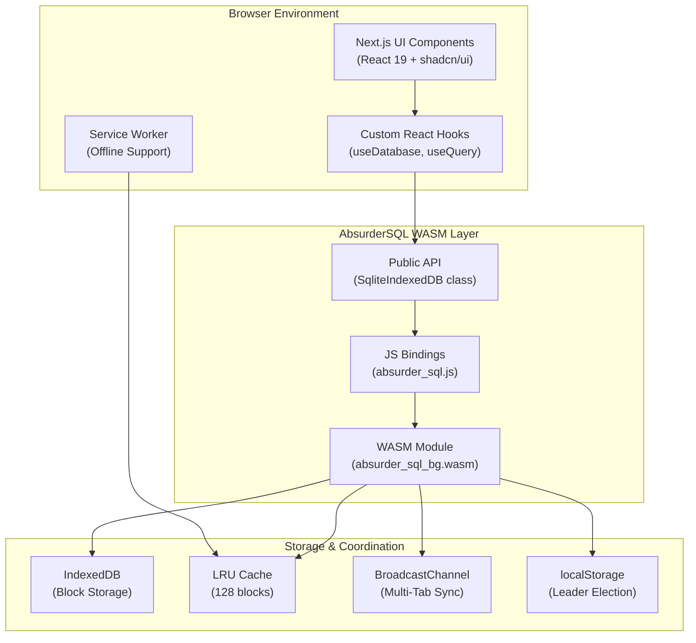
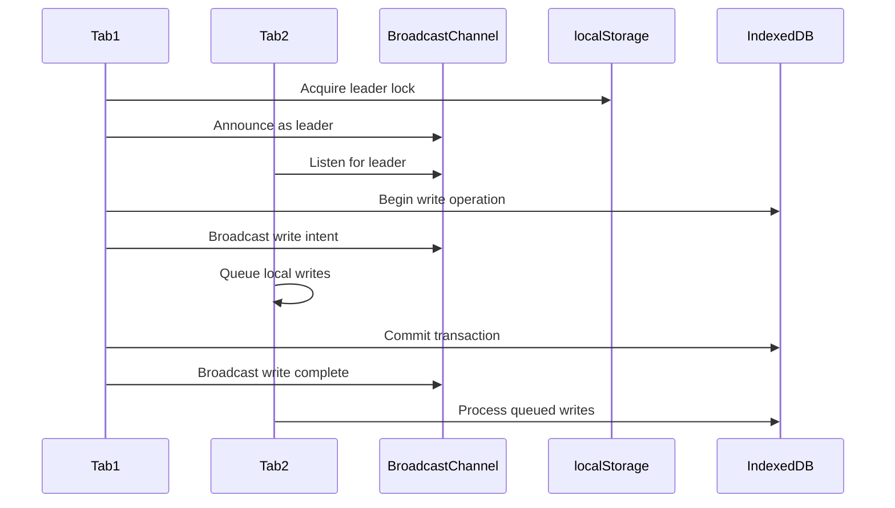
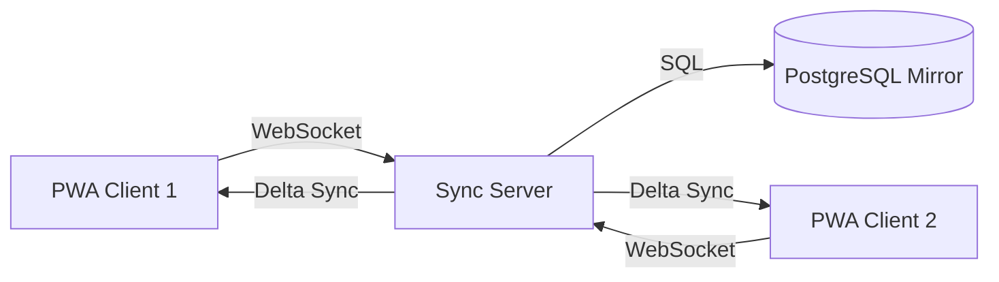

# Design Documentation
## AbsurderSQL PWA - Browser-Based SQLite Admin Tool

**Version:** 2.0  
**Last Updated:** October 29, 2025  
**Status:** Active Development  
**Target:** Next.js 15 + React 19 + AbsurderSQL WASM

**Product Vision:** Modern Adminer replacement - zero server setup, drag-and-drop .db files, instant querying

---

## Table of Contents

1. [System Overview](#system-overview)
2. [Architecture Diagram](#architecture-diagram)
3. [Component Design](#component-design)
4. [Data Flow](#data-flow)
5. [API Design](#api-design)
6. [Database Schema](#database-schema)
7. [Security Model](#security-model)
8. [Performance Considerations](#performance-considerations)
9. [Error Handling](#error-handling)

---

## System Overview

### High-Level Architecture

The PWA consists of three layers:

1. **Presentation Layer** - Next.js React components + UI
2. **Business Logic Layer** - Database hooks + state management
3. **Data Layer** - AbsurderSQL WASM + IndexedDB

### Technology Stack

```
┌─────────────────────────────────────────────┐
│         Next.js 15 App Router               │
│  (React 19 + TypeScript + Tailwind CSS)    │
└─────────────────────────────────────────────┘
                    ↓
┌─────────────────────────────────────────────┐
│      Custom React Hooks Layer               │
│  useDatabase, useQuery, useTransaction      │
└─────────────────────────────────────────────┘
                    ↓
┌─────────────────────────────────────────────┐
│       AbsurderSQL WASM Package              │
│    @npiesco/absurder-sql (npm package)      │
└─────────────────────────────────────────────┘
                    ↓
┌─────────────────────────────────────────────┐
│           Browser IndexedDB                  │
│     (4KB block-level storage + LRU cache)   │
└─────────────────────────────────────────────┘
```

---

## Architecture Diagram

### Complete System Architecture



### Multi-Tab Coordination



---

## Component Design

### 1. Core Components

#### `/app` Directory Structure

```
app/
├── layout.tsx                 # Root layout with providers
├── page.tsx                   # Home page
├── db/
│   ├── page.tsx              # Database management UI
│   ├── query/page.tsx        # Query interface
│   └── schema/page.tsx       # Schema viewer
├── api/
│   └── health/route.ts       # Health check endpoint
└── providers.tsx             # Context providers
```

#### `/lib` Directory Structure

```
lib/
├── db/
│   ├── client.ts             # AbsurderSQL client wrapper
│   ├── hooks.ts              # React hooks (useDatabase, useQuery)
│   ├── types.ts              # TypeScript types
│   └── utils.ts              # Helper functions
├── monitoring/
│   ├── telemetry.ts          # Performance tracking
│   └── errors.ts             # Error tracking
└── pwa/
    ├── service-worker.ts     # SW configuration
    └── manifest.ts           # PWA manifest
```

### 2. Database Client Wrapper

**File:** `/lib/db/client.ts`

```typescript
import init, { SqliteIndexedDB } from '@npiesco/absurder-sql';

export class DatabaseClient {
  private db: SqliteIndexedDB | null = null;
  private initialized: boolean = false;

  async initialize(): Promise<void> {
    if (this.initialized) return;
    
    // Initialize WASM module
    await init();
    this.initialized = true;
  }

  async open(dbName: string): Promise<void> {
    await this.initialize();
    this.db = new SqliteIndexedDB(dbName);
    await this.db.open();
  }

  async execute(sql: string, params?: any[]): Promise<QueryResult> {
    if (!this.db) throw new Error('Database not opened');
    return await this.db.execute(sql, params);
  }

  async export(): Promise<Blob> {
    if (!this.db) throw new Error('Database not opened');
    const buffer = await this.db.export();
    return new Blob([buffer], { type: 'application/x-sqlite3' });
  }

  async import(file: File): Promise<void> {
    await this.initialize();
    const buffer = await file.arrayBuffer();
    this.db = await SqliteIndexedDB.import(new Uint8Array(buffer));
  }

  async close(): Promise<void> {
    if (this.db) {
      await this.db.close();
      this.db = null;
    }
  }
}
```

### 3. React Hooks

**File:** `/lib/db/hooks.ts`

```typescript
import { useEffect, useState } from 'react';
import { DatabaseClient } from './client';

// Singleton database client
let dbClient: DatabaseClient | null = null;

export function useDatabase(dbName: string) {
  const [db, setDb] = useState<DatabaseClient | null>(null);
  const [loading, setLoading] = useState(true);
  const [error, setError] = useState<Error | null>(null);

  useEffect(() => {
    async function openDb() {
      try {
        if (!dbClient) {
          dbClient = new DatabaseClient();
        }
        await dbClient.open(dbName);
        setDb(dbClient);
      } catch (err) {
        setError(err as Error);
      } finally {
        setLoading(false);
      }
    }
    openDb();
  }, [dbName]);

  return { db, loading, error };
}

export function useQuery<T = any>(sql: string, params?: any[]) {
  const [data, setData] = useState<T | null>(null);
  const [loading, setLoading] = useState(true);
  const [error, setError] = useState<Error | null>(null);

  useEffect(() => {
    async function runQuery() {
      if (!dbClient) return;
      
      try {
        const result = await dbClient.execute(sql, params);
        setData(result.rows as T);
      } catch (err) {
        setError(err as Error);
      } finally {
        setLoading(false);
      }
    }
    runQuery();
  }, [sql, JSON.stringify(params)]);

  return { data, loading, error };
}

export function useTransaction() {
  const [pending, setPending] = useState(false);

  const execute = async (queries: Array<{ sql: string; params?: any[] }>) => {
    if (!dbClient) throw new Error('Database not initialized');
    
    setPending(true);
    try {
      await dbClient.execute('BEGIN TRANSACTION');
      
      for (const query of queries) {
        await dbClient.execute(query.sql, query.params);
      }
      
      await dbClient.execute('COMMIT');
    } catch (err) {
      await dbClient.execute('ROLLBACK');
      throw err;
    } finally {
      setPending(false);
    }
  };

  return { execute, pending };
}
```

### 4. UI Components

#### Database Manager Component

```typescript
// components/DatabaseManager.tsx
'use client';

import { useState } from 'react';
import { useDatabase } from '@/lib/db/hooks';
import { Button } from '@/components/ui/button';

export function DatabaseManager() {
  const [dbName, setDbName] = useState('myapp.db');
  const { db, loading, error } = useDatabase(dbName);

  const handleExport = async () => {
    if (!db) return;
    const blob = await db.export();
    const url = URL.createObjectURL(blob);
    const a = document.createElement('a');
    a.href = url;
    a.download = dbName;
    a.click();
  };

  const handleImport = async (file: File) => {
    if (!db) return;
    await db.import(file);
  };

  if (loading) return <div>Loading database...</div>;
  if (error) return <div>Error: {error.message}</div>;

  return (
    <div>
      <h2>Database: {dbName}</h2>
      <Button onClick={handleExport}>Export Database</Button>
      <input type="file" onChange={(e) => handleImport(e.target.files[0])} />
    </div>
  );
}
```

---

## Data Flow

### 1. Database Initialization Flow

```
User opens app
    ↓
Next.js renders page
    ↓
useDatabase hook triggered
    ↓
DatabaseClient.initialize() called
    ↓
WASM module loaded (init())
    ↓
SqliteIndexedDB.open(dbName)
    ↓
IndexedDB database created/opened
    ↓
Multi-tab leader election
    ↓
Database ready for queries
```

### 2. Query Execution Flow

```
User submits query
    ↓
useQuery hook triggered
    ↓
DatabaseClient.execute(sql, params)
    ↓
WASM: Prepare statement
    ↓
WASM: Check LRU cache for blocks
    ↓
Cache miss → Read from IndexedDB
Cache hit → Use cached blocks
    ↓
WASM: Execute query on SQLite
    ↓
WASM: Return rows as JSON
    ↓
React state updated
    ↓
UI re-renders with results
```

### 3. Export Flow

```
User clicks "Export"
    ↓
DatabaseClient.export()
    ↓
WASM: Serialize database to buffer
    ↓
WASM: Read all blocks from IndexedDB
    ↓
WASM: Construct SQLite file format
    ↓
Return Uint8Array
    ↓
Convert to Blob
    ↓
Trigger browser download
```

### 4. Import Flow

```
User selects .db file
    ↓
Read file as ArrayBuffer
    ↓
DatabaseClient.import(buffer)
    ↓
WASM: Parse SQLite file format
    ↓
WASM: Write blocks to IndexedDB
    ↓
WASM: Update metadata
    ↓
Database ready with imported data
```

---

## API Design

### Public API Surface

```typescript
// @npiesco/absurder-sql package exports

export class SqliteIndexedDB {
  constructor(dbName: string);
  
  // Database lifecycle
  open(): Promise<void>;
  close(): Promise<void>;
  
  // Queries
  execute(sql: string, params?: any[]): Promise<QueryResult>;
  prepare(sql: string): PreparedStatement;
  
  // Transactions
  beginTransaction(): Promise<void>;
  commit(): Promise<void>;
  rollback(): Promise<void>;
  
  // Export/Import
  export(): Promise<Uint8Array>;
  static import(buffer: Uint8Array): Promise<SqliteIndexedDB>;
  
  // Schema
  getTables(): Promise<string[]>;
  getSchema(table: string): Promise<ColumnInfo[]>;
  
  // Performance
  createIndex(table: string, columns: string): Promise<void>;
  vacuum(): Promise<void>;
}

export interface QueryResult {
  columns: string[];
  rows: any[][];
  rowsAffected: number;
}

export interface PreparedStatement {
  execute(params: any[]): Promise<QueryResult>;
  finalize(): Promise<void>;
}
```

### Custom React Hooks API

```typescript
// Hooks provided by PWA

// Database management
export function useDatabase(dbName: string): {
  db: DatabaseClient | null;
  loading: boolean;
  error: Error | null;
};

// Query execution
export function useQuery<T>(sql: string, params?: any[]): {
  data: T | null;
  loading: boolean;
  error: Error | null;
  refetch: () => Promise<void>;
};

// Transaction management
export function useTransaction(): {
  execute: (queries: Query[]) => Promise<void>;
  pending: boolean;
};

// Export/Import
export function useExport(): {
  exportDb: () => Promise<Blob>;
  loading: boolean;
};

export function useImport(): {
  importDb: (file: File) => Promise<void>;
  loading: boolean;
  progress: number;
};
```

---

## Database Schema

### Example Application Schema

```sql
-- Users table
CREATE TABLE users (
  id INTEGER PRIMARY KEY AUTOINCREMENT,
  email TEXT UNIQUE NOT NULL,
  name TEXT NOT NULL,
  created_at INTEGER NOT NULL
);

-- Posts table
CREATE TABLE posts (
  id INTEGER PRIMARY KEY AUTOINCREMENT,
  user_id INTEGER NOT NULL,
  title TEXT NOT NULL,
  content TEXT NOT NULL,
  created_at INTEGER NOT NULL,
  FOREIGN KEY (user_id) REFERENCES users(id)
);

-- Comments table
CREATE TABLE comments (
  id INTEGER PRIMARY KEY AUTOINCREMENT,
  post_id INTEGER NOT NULL,
  user_id INTEGER NOT NULL,
  content TEXT NOT NULL,
  created_at INTEGER NOT NULL,
  FOREIGN KEY (post_id) REFERENCES posts(id),
  FOREIGN KEY (user_id) REFERENCES users(id)
);

-- Indexes for performance
CREATE INDEX idx_posts_user_id ON posts(user_id);
CREATE INDEX idx_comments_post_id ON comments(post_id);
CREATE INDEX idx_comments_user_id ON comments(user_id);
```

---

## Security Model

### Content Security Policy

```typescript
// next.config.js
const cspHeader = `
  default-src 'self';
  script-src 'self' 'unsafe-eval' 'unsafe-inline';
  style-src 'self' 'unsafe-inline';
  img-src 'self' blob: data:;
  font-src 'self';
  object-src 'none';
  base-uri 'self';
  form-action 'self';
  frame-ancestors 'none';
  upgrade-insecure-requests;
`;
```

### Data Isolation

- **Same-Origin Policy:** IndexedDB data isolated by origin
- **No Cross-Tab Data Leaks:** BroadcastChannel confined to same origin
- **Local Storage Only:** No data sent to servers (optional sync in future)

### Input Validation

```typescript
// Always use parameterized queries
const safe = await db.execute(
  'SELECT * FROM users WHERE email = ?',
  [userInput]
);

// Never concatenate user input
const UNSAFE = await db.execute(
  `SELECT * FROM users WHERE email = '${userInput}'` // SQL injection risk
);
```

---

## Performance Considerations

### 1. WASM Loading Strategy

```typescript
// Dynamic import with loading state
const [wasmLoaded, setWasmLoaded] = useState(false);

useEffect(() => {
  import('@npiesco/absurder-sql').then(async (module) => {
    await module.default(); // Initialize WASM
    setWasmLoaded(true);
  });
}, []);
```

### 2. Code Splitting

```typescript
// app/db/page.tsx
import dynamic from 'next/dynamic';

const DatabaseManager = dynamic(() => import('@/components/DatabaseManager'), {
  loading: () => <p>Loading database...</p>,
  ssr: false, // Disable SSR for WASM components
});
```

### 3. LRU Cache Tuning

```typescript
// Increase cache size for better performance
const db = new SqliteIndexedDB('mydb.db', {
  cacheSize: 256, // Default is 128 blocks (512KB)
});
```

### 4. Indexing Strategy

```typescript
// Create indexes for frequently queried columns
await db.createIndex('users', 'email');
await db.createIndex('posts', 'user_id,created_at');
```

---

## Error Handling

### Error Types

```typescript
export enum DatabaseErrorType {
  INITIALIZATION_FAILED = 'INITIALIZATION_FAILED',
  QUOTA_EXCEEDED = 'QUOTA_EXCEEDED',
  QUERY_FAILED = 'QUERY_FAILED',
  TRANSACTION_ABORTED = 'TRANSACTION_ABORTED',
  EXPORT_FAILED = 'EXPORT_FAILED',
  IMPORT_FAILED = 'IMPORT_FAILED',
}

export class DatabaseError extends Error {
  constructor(
    public type: DatabaseErrorType,
    message: string,
    public originalError?: Error
  ) {
    super(message);
    this.name = 'DatabaseError';
  }
}
```

### Error Handling Strategy

```typescript
try {
  await db.execute(sql, params);
} catch (err) {
  if (err instanceof DOMException && err.name === 'QuotaExceededError') {
    // Handle quota exceeded
    throw new DatabaseError(
      DatabaseErrorType.QUOTA_EXCEEDED,
      'Storage quota exceeded. Please export and clear old data.',
      err
    );
  }
  
  // Log and re-throw
  console.error('Query failed:', err);
  throw new DatabaseError(
    DatabaseErrorType.QUERY_FAILED,
    'Failed to execute query',
    err as Error
  );
}
```

---

## Deployment Architecture

### Next.js Deployment on Vercel

```
User Browser
    ↓ HTTPS
Vercel Edge Network
    ↓
Next.js App (Static + SSR)
    ↓ (client-side only)
AbsurderSQL WASM
    ↓
Browser IndexedDB (local)
```

### Service Worker Caching

```typescript
// Service worker caches WASM binary
self.addEventListener('install', (event) => {
  event.waitUntil(
    caches.open('absurder-sql-v1').then((cache) => {
      return cache.addAll([
        '/absurder_sql_bg.wasm',
        '/absurder_sql.js',
      ]);
    })
  );
});
```

---

## Advanced Features (In Development)

### Server Synchronization Architecture



**Components:**
- WebSocket server for real-time sync
- PostgreSQL mirror database
- Conflict resolution engine (OT/CRDTs)
- Delta sync protocol
- Offline queue management

### Collaborative Editing Architecture

```typescript
// Operational Transform example
interface Operation {
  type: 'insert' | 'delete' | 'update';
  table: string;
  position: number;
  data: any;
  timestamp: number;
  userId: string;
}

// Transform function for concurrent operations
function transform(op1: Operation, op2: Operation): Operation {
  // OT logic to resolve conflicts
  if (op1.position <= op2.position) {
    return op2;
  }
  // Adjust positions based on op1
  return { ...op2, position: op2.position + adjustment };
}
```

**Features:**
- Real-time cursor positions
- User presence indicators (active users)
- Collaborative transactions
- Shared query editing
- Conflict-free replicated data types (CRDTs)

### Advanced Database Capabilities

**Full-Text Search (FTS5):**
```sql
-- Create FTS5 virtual table
CREATE VIRTUAL TABLE documents_fts 
USING fts5(title, content, tokenize='porter unicode61');

-- Full-text query with ranking
SELECT * FROM documents_fts 
WHERE documents_fts MATCH 'database AND (sql OR nosql)' 
ORDER BY rank;
```

**Spatial Queries (SpatiaLite):**
```sql
-- Find points within radius
SELECT * FROM locations 
WHERE ST_Distance(point, ST_MakePoint(-122.4, 37.8)) < 1000;
```

**Vector Search:**
```typescript
// Embedding-based similarity search
const embedding = await generateEmbedding(query);
const results = await db.execute(
  'SELECT * FROM vectors ORDER BY vec_distance(embedding, ?) LIMIT 10',
  [embedding]
);
```

### Enterprise Security Architecture

**Role-Based Access Control:**
```typescript
interface Permission {
  role: 'admin' | 'editor' | 'viewer';
  resource: string;
  actions: ('read' | 'write' | 'delete')[];
}

// Row-level security
CREATE POLICY user_policy ON users
  USING (id = current_user_id() OR role = 'admin');
```

**Audit Logging:**
```typescript
interface AuditLog {
  id: string;
  timestamp: number;
  userId: string;
  action: 'SELECT' | 'INSERT' | 'UPDATE' | 'DELETE';
  table: string;
  rowId?: any;
  before?: any;
  after?: any;
  hash: string; // Tamper-proof chain
}
```

**Data Encryption:**
```typescript
// Encryption at rest with AES-256
const encrypted = await crypto.subtle.encrypt(
  { name: 'AES-GCM', iv: iv },
  key,
  data
);
```

---

## Appendix

### Browser Compatibility Matrix

| Feature | Chrome | Firefox | Safari | Edge |
|---------|--------|---------|--------|------|
| WASM | 90+ | 88+ | 14+ | 90+ |
| IndexedDB | 90+ | 88+ | 14+ | 90+ |
| Service Worker | 90+ | 88+ | 14+ | 90+ |
| BroadcastChannel | 90+ | 88+ | 15.4+ | 90+ |
| PWA Install | ✅ | ✅ | ✅ | ✅ |

### References

- [Next.js Documentation](https://nextjs.org/docs)
- [AbsurderSQL GitHub](https://github.com/npiesco/absurder-sql)
- [Web.dev PWA Guide](https://web.dev/progressive-web-apps/)
- [IndexedDB API](https://developer.mozilla.org/en-US/docs/Web/API/IndexedDB_API)
