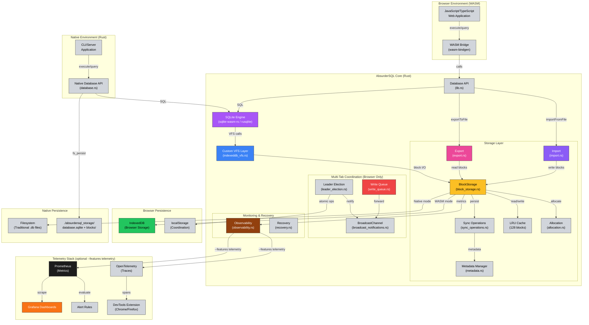

<div align="center">
  
  <h1>AbsurderSQL</h1>
  <p><strong>Rust + WASM + SQLite + IndexedDB</strong></p>
  
  [](https://www.npmjs.com/package/@npiesco/absurder-sql)
</div>

**Tech Stack:**  
[](Cargo.toml)
[](https://webassembly.org/)
[](https://www.sqlite.org/)
[](https://developer.mozilla.org/en-US/docs/Web/API/IndexedDB_API)

**Capabilities:**  
[](docs/DUAL_MODE.md)
[](docs/EXPORT_IMPORT.md)
[](#telemetry-optional)
[](monitoring/prometheus/)
[](monitoring/grafana/)
[](browser-extension/)

> *SQLite + IndexedDB + Custom VFS that's absurdly absurder than absurd-sql*

## This is an absurd*er* project.

It implements a custom SQLite Virtual File System (VFS) backend that treats **IndexedDB like a disk** and stores data in blocks there. Your database lives permanently in browser storage with **intelligent block-level I/O**—reading and writing 4KB chunks with LRU caching—avoiding the performance nightmare of serializing entire database files on every operation.

**It basically stores a whole database into another database using a custom VFS. Which is absurd*er*.**

But AbsurderSQL takes it further: it's **absurdly better**. Unlike absurd-sql, your data isn't locked in IndexedDB forever—you can **[export and import](docs/EXPORT_IMPORT.md)** standard SQLite files. Need to query from both browser and CLI? Use **[dual-mode persistence](docs/DUAL_MODE.md)**—same database structure, IndexedDB in the browser and real files on the server. Multiple tabs? **[Multi-tab coordination](docs/MULTI_TAB_GUIDE.md)** with automatic leader election prevents conflicts. Want production observability? Optional **[Prometheus + Grafana monitoring](monitoring/)** with **[DevTools extension](browser-extension/)** for debugging WASM telemetry.

**Read the [blog post](https://iscopesolutions.net/) that explains the absurdity in detail.**

---

### Why AbsurderSQL?

A high-performance **dual-mode** Rust library that brings full SQLite functionality to **both browsers and native applications**:

- **Browser (WASM)**: SQLite → IndexedDB with multi-tab coordination and full export/import
- **Native/CLI**: SQLite → Real filesystem with traditional `.db` files

**Unique Advantages:** 

Export/import databases as standard SQLite files (absurd-sql has no export/import—data is permanently locked in IndexedDB). Build web apps that store data in IndexedDB, then query the same database structure from CLI/server using standard SQLite tools. Multi-tab coordination with automatic leader election prevents conflicts. Perfect for offline-first applications with backup/restore, data migration, and optional server synchronization.

**Production Observability (Optional):** When enabled with `--features telemetry`, includes complete monitoring stack: Prometheus metrics, OpenTelemetry tracing, pre-built Grafana dashboards, production-ready alert rules with runbooks, and a Chrome/Firefox DevTools extension for debugging WASM telemetry. All telemetry features are opt-in—default builds include zero monitoring overhead.

Enabling production-ready SQL operations with crash consistency, multi-tab coordination, complete data portability, optional observability, and the flexibility to run anywhere from web apps to server applications.

## Dual-Mode Architecture

AbsurderSQL runs in **two modes** - Browser (WASM) and Native (Rust CLI/Server):


**Legend:**  
🟪 SQLite Engine • 🟦 VFS Layer • 🟨 BlockStorage • 🟩 Persistence • 🟥 Multi-Tab  
🟫 Observability • ⬛ Prometheus • 🟧 Grafana

## Project Structure

```
absurder-sql/
├── src/
│   ├── lib.rs              # WASM entry point, Database API exports
│   ├── database.rs         # Native Database implementation
│   ├── types.rs            # Core types (QueryResult, ColumnValue, etc.)
│   ├── utils.rs            # Utility functions
│   │
│   ├── bin/                # Binary executables
│   │   └── cli_query.rs    # CLI query tool for filesystem databases
│   │
│   ├── storage/            # Storage layer implementation
│   │   ├── mod.rs
│   │   ├── block_storage.rs           # Core block storage with LRU cache
│   │   ├── sync_operations.rs        # Cross-platform sync logic
│   │   ├── io_operations.rs          # Read/write operations
│   │   ├── allocation.rs             # Block allocation/deallocation
│   │   ├── metadata.rs               # Block metadata management
│   │   ├── export.rs                 # Database export to SQLite files
│   │   ├── import.rs                 # Database import from SQLite files
│   │   ├── retry_logic.rs            # Retry logic for transient failures
│   │   ├── fs_persist.rs             # Native filesystem persistence
│   │   ├── wasm_indexeddb.rs         # WASM IndexedDB integration
│   │   ├── wasm_vfs_sync.rs          # WASM VFS sync coordination
│   │   ├── recovery.rs               # Crash recovery logic
│   │   ├── auto_sync.rs              # Native auto-sync
│   │   ├── wasm_auto_sync.rs         # WASM auto-sync
│   │   ├── leader_election.rs        # Multi-tab leader election
│   │   ├── broadcast_notifications.rs # BroadcastChannel messaging
│   │   ├── write_queue.rs            # Write queuing for non-leaders
│   │   ├── optimistic_updates.rs     # Optimistic UI updates
│   │   ├── coordination_metrics.rs   # Performance metrics tracking
│   │   ├── observability.rs          # Metrics and monitoring
│   │   └── constructors.rs           # BlockStorage constructors
│   │
│   └── vfs/                # SQLite VFS implementation
│       ├── mod.rs
│       └── indexeddb_vfs.rs     # Custom VFS for IndexedDB
│
├── tests/                  # Comprehensive test suite
│   ├── integration_tests.rs          # End-to-end tests
│   ├── native_database_persistence_tests.rs  # Native filesystem tests
│   ├── wasm_integration_tests.rs     # WASM-specific tests (inc. export/import)
│   ├── export_import_examples_test.rs # Export/import validation tests
│   ├── export_import_lock_tests.rs   # Export/import locking tests
│   ├── vfs_durability_tests.rs       # VFS durability tests
│   ├── lru_cache_tests.rs            # Cache tests
│   ├── e2e/                          # Playwright E2E tests
│   │   ├── dual_mode_persistence.spec.js  # Browser + CLI validation
│   │   ├── advanced-features.spec.js
│   │   └── multi-tab-vite.spec.js
│   └── ...                           # 65+ test files total
│
├── examples/               # Browser demos and documentation
│   ├── vite-app/           # Production Vite application
│   ├── export_import_demo.html        # Export/import 4-step wizard demo
│   ├── export_import.js               # 9 production export/import examples
│   ├── test_export_import_examples.html # Export/import test suite
│   ├── sql_demo.html       # Interactive SQL demo page
│   ├── web_demo.html       # Full-featured web interface
│   ├── benchmark.html      # Performance comparison tool
│   ├── multi-tab-demo.html # Multi-tab coordination demo
│   ├── devtools_demo.html  # DevTools extension telemetry demo
│   └── DEMO_GUIDE.md       # Demo usage guide
│
├── docs/                   # Comprehensive documentation
│   ├── EXPORT_IMPORT.md    # Export/import guide (DATABASE PORTABILITY)
│   ├── DUAL_MODE.md        # Dual-mode persistence guide
│   ├── MULTI_TAB_GUIDE.md  # Multi-tab coordination
│   ├── TRANSACTION_SUPPORT.md # Transaction handling
│   ├── BENCHMARK.md        # Performance benchmarks
│   ├── CODING_STANDARDS.md # Development best practices
│   └── REMAINING_UNWRAPS.md # Unwrap safety analysis
│
├── monitoring/             # Production observability (optional --features telemetry)
│   ├── grafana/            # Pre-built Grafana dashboards
│   │   ├── query_performance.json
│   │   ├── storage_operations.json
│   │   ├── system_health.json
│   │   └── multi_tab_coordination.json
│   ├── prometheus/         # Alert rules and recording rules
│   │   └── alert_rules.yml # Alert rules + recording rules
│   └── RUNBOOK.md          # Alert runbooks and remediation procedures
│
├── browser-extension/      # Browser DevTools extension (Chrome/Firefox)
│   ├── manifest.json       # Manifest V3 extension configuration
│   ├── devtools.js         # Message hub (devtools page)
│   ├── content.js          # Content script (page bridge)
│   ├── panel.html/css/js   # DevTools panel UI
│   ├── icons/              # Extension icons (16, 48, 128)
│   ├── README.md           # Extension features and architecture
│   └── INSTALLATION.md     # Installation guide
│
├── pkg/                    # WASM build output (generated)
├── Cargo.toml             # Rust dependencies and config
├── package.json           # Node.js dependencies
└── README.md              # This file
```

## System Architecture

### Core Architecture
The project follows a modular architecture with clear separation of concerns:

**VFS Layer**: Implements a custom SQLite Virtual File System that translates SQLite's file operations to IndexedDB operations. This allows SQLite to work seamlessly with browser storage without modifications to the core SQLite engine.

**Storage Abstraction**: Provides a unified interface for different storage backends, with IndexedDB as the primary target. The design allows for future expansion to other storage mechanisms while maintaining API compatibility.

**WASM Bridge**: Handles the interface between Rust code and JavaScript, managing memory allocation, type conversions, and async operation bridging. Uses `sqlite-wasm-rs` for stable SQLite operations without the hang issues that affected previous implementations. This ensures smooth interoperability between the WASM module and browser JavaScript.

**Type System**: Defines comprehensive data structures for SQL operations, query results, and configuration options, ensuring type safety across the Rust-JavaScript boundary.

### Frontend Architecture
The web demo uses vanilla JavaScript with Bootstrap for styling, demonstrating real-time SQL query execution and result visualization. The frontend architecture emphasizes simplicity and direct WASM integration without complex frameworks.

### Data Storage Design
**Primary Storage**: IndexedDB serves as the persistent storage layer, chosen for its transaction support, large storage capacity, and widespread browser compatibility.

**Memory Management**: The library implements careful memory management for WASM operations, ensuring proper cleanup of allocated memory and efficient data transfer between Rust and JavaScript contexts.

**Transaction Handling**: Leverages SQLite's transaction capabilities while ensuring proper coordination with IndexedDB's transaction model for data consistency.

### Configuration System
The architecture supports configurable database options including cache size, synchronization modes, and VFS-specific settings, allowing optimization for different use cases and performance requirements.

---

## Export/Import: Full Database Portability

**AbsurderSQL provides complete database export and import functionality - a critical feature that absurd-sql completely lacks.**

### Why This Matters

With AbsurderSQL, your data is **never locked in the browser**. You can:

- **Export** databases as standard SQLite files
- **Import** databases from SQLite files
- **Backup** your data with one function call
- **Migrate** databases between devices and browsers
- **Debug** exported files with sqlite3 CLI or DB Browser
- **Share** databases as downloadable files

**absurd-sql alternative**: No export/import - data is permanently trapped in IndexedDB

### Quick Example

```javascript
// From npm package
import init, { Database } from '@npiesco/absurder-sql';

// Or from local build
// import init, { Database } from './pkg/absurder_sql.js';

await init();
const db = await Database.newDatabase('myapp.db');

// Create some data
await db.execute('CREATE TABLE users (id INTEGER PRIMARY KEY, name TEXT)');
await db.execute("INSERT INTO users VALUES (1, 'Alice')");

// EXPORT: Get entire database as standard SQLite file
const exportedData = await db.exportToFile();

// Download for user
const blob = new Blob([exportedData], { type: 'application/octet-stream' });
const url = URL.createObjectURL(blob);
const a = document.createElement('a');
a.href = url;
a.download = 'myapp.db';
a.click();

// IMPORT: Load database from file
const file = document.getElementById('fileInput').files[0];
const arrayBuffer = await file.arrayBuffer();
await db.importFromFile(new Uint8Array(arrayBuffer));

// Reopen to use imported data
const db2 = await Database.newDatabase('myapp.db');
```

### Interactive Demos

- **[Export/Import Demo](examples/export_import_demo.html)** - 4-step wizard with progress tracking
- **[Automated Tests](examples/test_export_import_examples.html)** - 5 validation tests
- **[Code Examples](examples/export_import.js)** - 9 production-ready examples

### Full Documentation

See **[docs/EXPORT_IMPORT.md](docs/EXPORT_IMPORT.md)** for:
- Complete API reference
- Architecture details
- Best practices & patterns
- Troubleshooting guide
- Size limits & performance

---

## Getting Started

### Installation

#### Option 1: Install from npm (Recommended)

```bash
npm install @npiesco/absurder-sql
```

Then use in your project:

```javascript
import init, { Database } from '@npiesco/absurder-sql';

// Initialize WASM
await init();

// Create database
const db = await Database.newDatabase('myapp.db');

// Use SQLite
await db.execute('CREATE TABLE users (id INTEGER PRIMARY KEY, name TEXT)');
await db.execute("INSERT INTO users VALUES (1, 'Alice')");
const result = await db.execute('SELECT * FROM users');

// Export for backup
const backup = await db.exportToFile();

// Close when done
await db.close();
```

**Package includes:**
- Pre-built WASM binary (~1.3MB, ~595KB gzipped)
- TypeScript definitions
- All necessary JavaScript glue code
- **No telemetry dependencies** - minimal size, zero observability overhead

> **Note:** The npm package is built without the `telemetry` feature for smaller size and faster load times. If you need Prometheus/OpenTelemetry support for production monitoring, build from source with `--features telemetry`.

#### Option 2: Build from Source

For development or custom builds:

**Prerequisites:**
- **Rust 1.85.0+** with the 2024 edition
- **wasm-pack** for building WASM packages
- **Node.js 18+** for running examples

```bash
# Clone the repository
git clone https://github.com/npiesco/absurder-sql
cd absurder-sql

# Install wasm-pack if needed
curl https://rustwasm.github.io/wasm-pack/installer/init.sh -sSf | sh

# Build for web
wasm-pack build --target web --out-dir pkg
```

This generates the `pkg/` directory containing:
- `absurder_sql.js` - JavaScript module
- `absurder_sql_bg.wasm` - WebAssembly binary (~1.3MB)
- TypeScript definitions and package files

### Optional Features

AbsurderSQL supports optional feature flags to minimize dependencies and binary size:

#### Telemetry (Optional - Build from Source Only)

**The npm package does NOT include telemetry** for minimal size. To enable telemetry features (Prometheus metrics, OpenTelemetry tracing), you must build from source with the `telemetry` feature flag:

```bash
# Build with telemetry support (Prometheus + OpenTelemetry)
wasm-pack build --target web --out-dir pkg --features telemetry

# Build without telemetry (default - smaller binary, zero telemetry overhead)
wasm-pack build --target web --out-dir pkg
```

**What telemetry provides:**
- Prometheus metrics (queries, errors, cache hits/misses, block operations)
- OpenTelemetry distributed tracing spans
- Performance monitoring and observability

**Dependencies (only when `telemetry` feature is enabled):**
- `prometheus` - Metrics collection
- `opentelemetry` - Distributed tracing
- `opentelemetry_sdk` - Tracing SDK
- `opentelemetry-prometheus` - Prometheus exporter

**When to use:**
- Production monitoring and observability
- Performance debugging and profiling
- Integration with Grafana/Prometheus stack
- Not needed for typical applications (default build excludes it)

**Exposing Metrics for Prometheus (Native Applications):**

AbsurderSQL collects metrics in-memory but does NOT include an HTTP server. For Prometheus scraping, add a `/metrics` endpoint to your application's HTTP server:

```rust
// Example with axum
use absurder_sql::Database;
use prometheus::Encoder;
use axum::{Router, routing::get, extract::State};

async fn metrics_handler(State(db): State<Database>) -> String {
    #[cfg(feature = "telemetry")]
    if let Some(metrics) = db.metrics() {
        let encoder = prometheus::TextEncoder::new();
        let metric_families = metrics.registry().gather();
        return encoder.encode_to_string(&metric_families).unwrap();
    }
    "Telemetry not enabled".to_string()
}

#[tokio::main]
async fn main() {
    let db = Database::new("myapp.db").await.unwrap();
    let app = Router::new()
        .route("/metrics", get(metrics_handler))
        .with_state(db);
    
    axum::Server::bind(&"0.0.0.0:9090".parse().unwrap())
        .serve(app.into_make_service())
        .await
        .unwrap();
}
```

Then configure Prometheus to scrape `http://localhost:9090/metrics`.

**Additional actix-web example:**

```rust
use absurder_sql::Database;
use actix_web::{web, App, HttpServer, HttpResponse};
use prometheus::Encoder;

async fn metrics(db: web::Data<Database>) -> HttpResponse {
    #[cfg(feature = "telemetry")]
    if let Some(metrics) = db.metrics() {
        let encoder = prometheus::TextEncoder::new();
        let metric_families = metrics.registry().gather();
        let body = encoder.encode_to_string(&metric_families).unwrap();
        return HttpResponse::Ok()
            .content_type("text/plain; version=0.0.4")
            .body(body);
    }
    HttpResponse::Ok().body("Telemetry not enabled")
}
```

### Production Observability Stack

When `--features telemetry` is enabled, AbsurderSQL provides a complete production observability stack.

**[Complete Monitoring Setup Guide](monitoring/README.md)** | **[Alert Runbook](monitoring/RUNBOOK.md)** | **[DevTools Extension](browser-extension/README.md)**

#### Grafana Dashboards (4 Dashboards, 28 Panels)

Pre-built Grafana dashboards provide real-time visibility into database operations:

1. **Query Performance Dashboard** (`monitoring/grafana/query_performance.json`)
   - Query execution times (p50, p90, p99)
   - Query rate and error rate
   - Slow query detection
   - 7 panels with drill-down capabilities

2. **Storage Operations Dashboard** (`monitoring/grafana/storage_operations.json`)
   - Block read/write rates
   - Cache hit rates and effectiveness
   - Storage layer latency
   - 6 panels for storage health monitoring

3. **System Health Dashboard** (`monitoring/grafana/system_health.json`)
   - Error rates by type
   - Transaction success rates
   - Resource utilization
   - 8 panels for overall system health

4. **Multi-Tab Coordination Dashboard** (`monitoring/grafana/multi_tab_coordination.json`)
   - Leader election status
   - Write queue depth
   - Sync operations
   - 7 panels for multi-tab debugging

**Import dashboards:** Load the JSON files directly into Grafana. All dashboards include variable templates for filtering by database instance.

#### Alert Rules (18 Alerts + 26 Recording Rules)

Production-ready Prometheus alert rules with runbooks:

**Critical Alerts:**
- High error rate (>5% over 5 minutes)
- Extreme query latency (p99 > 1 second)
- Zero query throughput (potential deadlock)
- Storage failures (>3 failures per minute)

**Warning Alerts:**
- Elevated error rates, slow queries, cache inefficiency
- Multi-tab coordination issues

**Info Alerts:**
- New leader elected, first query executed

**Recording Rules:**
- Pre-aggregated metrics for faster dashboard queries
- Query rate calculations, error ratios, latency percentiles

All alerts include:
- Severity labels (critical/warning/info)
- Team routing (database-team/platform-team)
- Detailed annotations explaining the issue
- Links to runbooks with remediation steps

**Location:** `monitoring/prometheus/alert_rules.yml`

**Runbooks:** `monitoring/RUNBOOK.md` provides step-by-step debugging and remediation procedures for every alert type.

#### Browser DevTools Extension

Chrome/Firefox extension for debugging WASM telemetry in the browser:

**Features:**
- Real-time span visualization with filtering
- Export statistics (success/failure rates)
- Manual flush trigger
- Buffer inspection
- OTLP endpoint configuration

**Architecture:** Manifest V3 compliant with proper message passing (page → content script → devtools hub → panel)

**Installation:**
1. Chrome: Load unpacked from `browser-extension/`
2. Firefox: Load temporary add-on from `browser-extension/manifest.json`

See `browser-extension/README.md` and `browser-extension/INSTALLATION.md` for complete setup instructions.

**Demo Page:** `examples/devtools_demo.html` generates sample telemetry for testing the extension.

#### Filesystem Persistence (Native Only)

Enable native filesystem persistence for CLI/server applications:

```bash
# Build with filesystem persistence
cargo build --features fs_persist

# Run tests with filesystem persistence
cargo test --features fs_persist
```

**Note:** All telemetry code is properly feature-gated - when the `telemetry` feature is disabled, zero telemetry code is compiled into your binary. This ensures minimal binary size and zero runtime overhead for applications that don't need observability features.

### Browser Usage (WASM)

```javascript
// From npm package
import init, { Database } from '@npiesco/absurder-sql';

// Or from local build
// import init, { Database } from './pkg/absurder_sql.js';

// Initialize WASM
await init();

// Create database - persists to IndexedDB
const db = await Database.newDatabase('myapp');

// Execute SQL
await db.execute('CREATE TABLE users (id INT, name TEXT)');
await db.execute("INSERT INTO users VALUES (1, 'Alice')");
const result = await db.execute('SELECT * FROM users');

// Persist to IndexedDB
await db.sync();

// Close
await db.close();
```

### Native/CLI Usage (Filesystem)

```bash
# Build the CLI tool
cargo build --bin cli_query --features fs_persist --release

# Create table
cargo run --bin cli_query --features fs_persist -- \
  "CREATE TABLE users (id INTEGER PRIMARY KEY, name TEXT, email TEXT)"

# Insert data
cargo run --bin cli_query --features fs_persist -- \
  "INSERT INTO users (name, email) VALUES ('Alice', 'alice@example.com')"

# Query data
cargo run --bin cli_query --features fs_persist -- \
  "SELECT * FROM users"

# Special commands
cargo run --bin cli_query --features fs_persist -- ".tables"
cargo run --bin cli_query --features fs_persist -- ".schema"
```

**Data Location:** `./absurdersql_storage/<db_name>/database.sqlite`

See [**docs/DUAL_MODE.md**](docs/DUAL_MODE.md) for complete dual-mode guide.

## Performance Features

AbsurderSQL includes several performance optimizations for high-throughput applications:

### Transaction-Deferred Sync

Filesystem sync operations are automatically deferred during transactions for massive performance improvements:

```javascript
// Without transactions: ~2883ms for 1000 inserts (sync after each)
for (let i = 0; i < 1000; i++) {
  await db.execute(`INSERT INTO data VALUES (${i}, 'value${i}')`);
}

// With transactions: <1ms for 1000 inserts (sync only on COMMIT)
await db.execute('BEGIN TRANSACTION');
for (let i = 0; i < 1000; i++) {
  await db.execute(`INSERT INTO data VALUES (${i}, 'value${i}')`);
}
await db.execute('COMMIT');  // Single sync here
```

**Performance:** 2278x speedup for bulk inserts (1034ms → 0.45ms for 100 inserts)

### Batch Execution

Execute multiple SQL statements in one call to reduce bridge overhead (especially important for React Native):

```javascript
// Native API (browser/WASM)
const statements = [
  "INSERT INTO users VALUES (1, 'Alice')",
  "INSERT INTO users VALUES (2, 'Bob')",
  "INSERT INTO users VALUES (3, 'Charlie')"
];

await db.executeBatch(statements);
```

**Performance:** Reduces N bridge calls to 1 call. For 5000 statements:
- Individual calls: ~170ms bridge overhead (0.034ms × 5000)
- Batch call: ~12ms total execution time

### Prepared Statements (Native Only)

Eliminate SQL re-parsing overhead for repeated queries:

```rust
// Native/CLI usage only (not available in WASM)
use absurder_sql::{SqliteIndexedDB, DatabaseConfig, ColumnValue};

let mut db = SqliteIndexedDB::new(config).await?;

// Prepare once
let mut stmt = db.prepare("INSERT INTO users VALUES (?, ?, ?)")?;

// Execute many times
for i in 1..=1000 {
    stmt.execute(&[
        ColumnValue::Integer(i),
        ColumnValue::Text(format!("User{}", i)),
        ColumnValue::Integer(25 + (i % 50)),
    ]).await?;
}

// Cleanup
stmt.finalize()?;
```

**Supported parameter styles:**
- Positional: `?`
- Numbered: `?1`, `?2` (can reuse same parameter)
- Named: `:name`, `:id`

**Performance:** 1.5-2x faster for repeated queries (eliminates SQL parsing on each execution)

**Note:** PreparedStatement is currently available for native/CLI applications only. Browser/WASM support will be added in a future release.

## SQLite WASM Integration

### Architecture Overview
The library provides a robust SQLite implementation for WebAssembly environments using the `sqlite-wasm-rs` crate with precompiled features. This ensures stable, production-ready SQLite functionality without the hang issues that plagued earlier custom implementations.

### Key Features
- **Full SQLite C API Support**: Complete implementation of `sqlite3_prepare_v2`, `sqlite3_step`, `sqlite3_finalize`, and parameter binding
- **Memory Safety**: Proper Rust `Drop` trait implementation for automatic cleanup of SQLite resources
- **Async Operations**: All database operations are async-compatible for seamless integration with browser event loops
- **Type Safety**: Comprehensive `ColumnValue` enum supporting all SQLite data types (NULL, INTEGER, REAL, TEXT, BLOB, BIGINT, DATE)
- **JavaScript Interop**: Complete `wasm-bindgen` exports with `WasmColumnValue` wrapper for seamless JS integration
- **Database Encryption** (Native): Optional SQLCipher integration with AES-256 encryption for secure data at rest (`--features encryption`)

## Multi-Tab Coordination

AbsurderSQL includes comprehensive multi-tab coordination for browser applications, ensuring data consistency across multiple tabs without conflicts.

### Core Features
- **Automatic Leader Election**: First tab becomes leader using localStorage coordination
- **Write Guard**: Only the leader tab can execute write operations (INSERT, UPDATE, DELETE)
- **BroadcastChannel Sync**: Automatic change notifications to all tabs
- **Failover Support**: Automatic re-election when leader tab closes
- **Zero Configuration**: Works out of the box, no setup required

### Advanced Features
- **Write Queuing**: Non-leaders can queue writes that forward to leader automatically
- **Optimistic Updates**: Track pending writes for immediate UI feedback
- **Coordination Metrics**: Monitor performance and coordination events

### Quick Example

```javascript
// From npm package
import init, { Database } from '@npiesco/absurder-sql';

// Or from local build
// import init, { Database } from './pkg/absurder_sql.js';
import { MultiTabDatabase } from './examples/multi-tab-wrapper.js';

await init();

// Create multi-tab database
const db = new MultiTabDatabase(Database, 'myapp.db', {
  autoSync: true  // Auto-sync after writes
});
await db.init();

// Check leader status
if (await db.isLeader()) {
  // Only leader can write
  await db.write("INSERT INTO users VALUES (1, 'Alice')");
}

// All tabs can read
const result = await db.query("SELECT * FROM users");

// Listen for changes from other tabs
db.onRefresh(() => {
  console.log('Data changed in another tab!');
  // Refresh UI
});
```

### Advanced Features

```javascript
// Write Queuing - Queue from any tab
await db.queueWrite("INSERT INTO logs VALUES (1, 'event')");
await db.queueWriteWithTimeout("UPDATE data SET processed = 1", 10000);

// Optimistic Updates - Track pending writes
await db.enableOptimisticUpdates(true);
const writeId = await db.trackOptimisticWrite("INSERT INTO users...");
const pendingCount = await db.getPendingWritesCount();

// Coordination Metrics - Monitor performance
await db.enableCoordinationMetrics(true);
await db.recordLeadershipChange(true);
await db.recordNotificationLatency(15.5);
const metrics = JSON.parse(await db.getCoordinationMetrics());

// Helper Methods
await db.waitForLeadership();  // Wait to become leader
await db.requestLeadership();   // Request leadership
const info = await db.getLeaderInfo();  // Get leader info
await db.allowNonLeaderWrites(true);  // Override for single-tab apps
```

### Live Demos
- **[Multi-Tab Demo](examples/multi-tab-demo.html)** - Interactive task list with multi-tab sync
- **[Vite App](examples/vite-app/)** - Production-ready multi-tab example
- **[Complete Guide](docs/MULTI_TAB_GUIDE.md)** - Full documentation and patterns

**Open the demo in multiple browser tabs to see coordination in action!**

---

## Demos & Examples

### Vite Integration (`vite-app/`)
Modern web app example with **multi-tab coordination**:
- ES modules with hot reload
- Multi-tab leader election
- Real-time sync across tabs
- Leader/follower UI indicators
- Production-ready build

**[Full setup guide](examples/vite-app/README.md)**

```bash
cd examples/vite-app
npm install
npm run dev
# Open in multiple tabs!
```

### SQL Demo (`sql_demo.js` / `sql_demo.html`)
Comprehensive SQL operations demo:
- Table creation with foreign keys
- INSERT operations with transactions
- Complex SELECT queries with JOINs and aggregations
- UPDATE and DELETE operations
- Automatic IndexedDB persistence via `sync()` calls

```bash
node examples/sql_demo.js
```

### Interactive Web Demo (`web_demo.html`)
Full-featured interactive SQL interface:
- Visual query editor
- Real-time query execution and result display
- Console output for debugging
- Quick action buttons for common operations
- Automatic sync after write operations

**[Detailed walkthrough](examples/DEMO_GUIDE.md)**

```bash
npm run serve
# Open http://localhost:8080/examples/web_demo.html
```

## Performance Benchmarks

AbsurderSQL consistently outperforms absurd-sql and raw IndexedDB across all operations.

**[Full benchmark results and analysis](docs/BENCHMARK.md)**

### Latest Results

| Implementation | Insert | Read | Update | Delete |
|---------------|--------|------|--------|--------|
| **AbsurderSQL** 🏆 | **3.2ms** | **1.2ms** | **400μs** | **400μs** |
| absurd-sql | 3.8ms | 2.1ms | 800μs | 700μs |
| Raw IndexedDB | 24.1ms | 1.4ms | 14.1ms | 6.3ms |

### Run Benchmarks

```bash
npm run serve
# Open http://localhost:8080/examples/benchmark.html
```

---

## Comparison with absurd-sql

AbsurderSQL is inspired by and builds upon the excellent work of [absurd-sql](https://github.com/jlongster/absurd-sql) by James Long, which pioneered SQLite-in-IndexedDB. Here's how they compare:

### Similarities
Both projects share core concepts:
- IndexedDB as persistent storage backend
- Block/page-based storage (not single-file)
- Full SQLite functionality in browser
- Significantly better performance than raw IndexedDB

### Key Architectural Differences

| Feature | **absurd-sql** | **AbsurderSQL** |
|---------|----------------|--------------|
| **Engine** | sql.js (Emscripten) | sqlite-wasm-rs (Rust C API) |
| **Language** | JavaScript | Rust/WASM |
| **Platform** | **Browser only** | **Browser + Native/CLI** |
| **Storage** | Variable SQLite pages (8KB suggested) | Fixed 4KB blocks |
| **Worker** | Optional (fallback mode works on main thread) | Optional (works on main thread) |
| **SharedArrayBuffer** | Optional (faster with SAB, fallback without) | Not used |
| **CORS Headers** | Optional (only if using SAB mode) | Not required |

### Database Portability & Export/Import

| Feature | **absurd-sql** | **AbsurderSQL** |
|---------|----------------|--------------|
| **Export to File** | **Not supported** | Full SQLite file export |
| **Import from File** | **Not supported** | Standard SQLite import |
| **Database Backup** | Locked in IndexedDB | Download as `.db` files |
| **Data Migration** | Manual only | Automated export/import |
| **File Portability** | No file access | Use with sqlite3, DB Browser |
| **Multi-Device Sync** | Not possible | Export -> share -> import |
| **Disaster Recovery** | No backups | Full backup/restore |

### Multi-Tab Coordination

| Feature | **absurd-sql** | **AbsurderSQL** |
|---------|----------------|--------------|
| **Coordination** | Throws errors | Coordinated with write queuing |
| **Leadership** | No concept | Automatic election with failover |
| **Follower Writes** | Not supported | Supported via `queueWrite()` |

### Technical Implementation Highlights
**absurd-sql:**
- sql.js VFS interception for file operations
- Two modes: SAB mode (fast) or FileOpsFallback (compatible)
- SAB mode: Worker + SharedArrayBuffer for synchronous ops
- Fallback mode: Works anywhere, "one writer at a time"

**AbsurderSQL:**
- Custom Rust IndexedDB VFS implementation
- localStorage atomic coordination primitives
- Block-level checksums and versioning (MVCC-style)
- LRU cache (128 blocks default)
- Full multi-tab write coordination (no errors)
- Works everywhere (localStorage-based, no SAB)

### Which Should You Choose?

**Choose AbsurderSQL if you:**

**[CRITICAL] Need database export/import (DATA PORTABILITY)**
- Export databases as standard SQLite files users can download
- Import databases from file uploads or shared files
- Backup/restore workflows for disaster recovery
- Migrate data between devices, browsers, or users
- Open exported files with sqlite3 CLI, DB Browser, or any SQLite tool
- Share databases as files (email, cloud storage, USB drives)
- *Why this matters:* absurd-sql has **NO export/import** - your data is permanently locked in IndexedDB

**[✓] Need dual-mode persistence (Browser + Native)**
- Build web apps with IndexedDB storage
- Query the same data from CLI/server using traditional `.db` files
- Offline-first apps with optional server sync
- Debug production data locally using standard SQLite tools
- *Why this matters:* absurd-sql is **browser-only** - no CLI/server access to your data

**[✓] Want zero deployment friction**
- Deploy to GitHub Pages, Netlify, Vercel, or any CDN instantly
- No server configuration or CORS header setup required
- Works in iframes and embedded contexts
- *Why this matters:* absurd-sql's SAB mode requires special HTTP headers (COEP/COOP) for best performance, though fallback mode works without them

**[✓] Want flexible architecture**
- Can run on main thread OR in Web Worker (your choice)
- Simpler integration - no mandatory worker setup
- Easy to add to existing apps without refactoring
- *Why this matters:* absurd-sql's SAB mode requires a Web Worker, though fallback mode can run on main thread with performance trade-offs

**[✓] Need multi-tab applications**
- Multiple tabs can write data without coordination errors
- Automatic conflict resolution with leader election
- User can have multiple tabs open without issues (e.g., documentation in one tab, app in another)
- *Why this matters:* absurd-sql throws errors if multiple tabs try to write simultaneously

**[✓] Value data integrity**
- Built-in checksums detect corruption
- Crash consistency guarantees (committed data survives browser crashes)
- MVCC-style versioning prevents race conditions
- *Why this matters:* Protects against data loss from browser crashes, bugs, or unexpected shutdowns

**[✓] Want better performance**
- 16-50% faster than absurd-sql across all operations
- LRU caching optimizes hot data access
- Efficient 4KB block size balances memory and I/O
- *Why this matters:* Faster queries = better user experience, especially on mobile devices

**[✓] Need production-ready tooling**
- Comprehensive test suite (WASM + Native + E2E tests)
- Full TypeScript definitions
- Active development and maintenance
- *Why this matters:* Confidence in reliability, easier debugging, better IDE support

**Choose absurd-sql if you:**

**[!] Already invested in sql.js**
- Have existing sql.js code you want to keep
- Need to support very old browsers without WASM support (pre-2017)
- Trade-off: Miss out on Rust's memory safety and performance

**[!] Prefer pure JavaScript stack**
- Don't want to deal with Rust/WASM compilation (though wasm-pack makes this trivial)
- Want to read/modify source code in JavaScript
- Trade-off: Slower performance, more deployment complexity

**[!] Don't need multi-tab**
- Single-tab application only
- Users never have multiple tabs open
- Trade-off: Limited scalability if requirements change later

**Bottom Line:**
- **AbsurderSQL** = Modern, fast, works everywhere, multi-tab ready, export/import support
- **absurd-sql** = Proven, JavaScript-only, two modes (SAB or fallback), single-tab focus

**[Detailed technical comparison in BENCHMARK.md](docs/BENCHMARK.md#comparison-with-absurd-sql)**

---

## Known Issues & Troubleshooting

### Transient "readonly database" Error in Native Tests

**Issue**: When running native tests with `cargo test --features fs_persist`, you may encounter a transient failure in `test_database_operations_across_threads`:

```
test_database_operations_across_threads ... FAILED

thread 'test_database_operations_across_threads' panicked at tests/send_safety_test.rs:74:10:
Failed to insert: DatabaseError { 
  code: "SQLITE_ERROR", 
  message: "attempt to write a readonly database", 
  sql: Some("INSERT INTO test (value) VALUES ('test_value')") 
}
```

**Root Cause**: Stale database files from previous test runs can persist in multiple storage directories. When tests attempt to reuse these files, SQLite may open them in read-only mode due to file permissions or lock state inconsistencies from interrupted test runs.

**Storage Directories Created by Tests:**
- `.absurdersql_fs` - Primary test storage directory
- `test_storage` - Additional test database storage
- `datasync_storage` - Multi-tab sync test storage
- `absurdersql_storage` - Native persistence test storage

**Solution**: Remove all stale storage directories before running tests:

```bash
# Clean up all stale test databases
rm -rf .absurdersql_fs test_storage datasync_storage absurdersql_storage

# Run tests fresh
cargo test --features fs_persist
```

**Prevention**: The test suite creates unique run directories (e.g., `run_<pid>`) to isolate test runs, but interrupted tests (Ctrl+C, IDE stop) may not clean up properly. Consider adding this cleanup to your test scripts or CI/CD pipelines:

```bash
#!/bin/bash
# test-with-cleanup.sh
rm -rf .absurdersql_fs test_storage datasync_storage absurdersql_storage
cargo test --features fs_persist "$@"
```

**Note**: This issue does not affect production usage - only test environments where multiple test runs accumulate stale databases. Production applications using `fs_persist` with proper database lifecycle management (open → use → close) are not affected.

---

## Documentation

### User Guides
- **[Export/Import Guide](docs/EXPORT_IMPORT.md)** - **DATABASE PORTABILITY** - Complete export/import reference (HUGE advantage over absurd-sql)
- **[Dual-Mode Persistence Guide](docs/DUAL_MODE.md)** - Browser + Native filesystem support
- **[Multi-Tab Coordination Guide](docs/MULTI_TAB_GUIDE.md)** - Complete guide for multi-tab coordination
- **[Transaction Support](docs/TRANSACTION_SUPPORT.md)** - Transaction handling and multi-tab transactions
- **[Benchmark Results](docs/BENCHMARK.md)** - Performance comparisons and metrics
- **[Demo Guide](examples/DEMO_GUIDE.md)** - How to run the interactive demos
- **[Vite App Example](examples/vite-app/README.md)** - Production-ready multi-tab application

### Development & Quality
- **[Coding Standards](docs/CODING_STANDARDS.md)** - Best practices, error handling, and testing requirements
- **[Unwrap Safety Analysis](docs/REMAINING_UNWRAPS.md)** - Comprehensive analysis of remaining unwraps

### Observability & Monitoring (Optional `--features telemetry`)
- **[Alert Runbook](monitoring/RUNBOOK.md)** - Complete debugging and remediation procedures for all alerts
- **[DevTools Extension](browser-extension/README.md)** - Browser extension features and architecture guide
- **[DevTools Installation](browser-extension/INSTALLATION.md)** - Step-by-step installation for Chrome/Firefox

## External Dependencies

### Rust Dependencies

#### Core Dependencies (Always Included)
- **sqlite-wasm-rs**: Production-ready SQLite WASM bindings with precompiled features
- **rusqlite**: Primary SQLite interface for native Rust builds, providing safe bindings to SQLite C library
- **wasm-bindgen**: Facilitates communication between Rust and JavaScript in WASM context
- **js-sys**: Provides bindings to JavaScript's built-in objects and functions
- **web-sys**: Offers bindings to Web APIs including IndexedDB
- **serde**: Handles serialization/deserialization for data exchange
- **tokio**: Provides async runtime support for handling asynchronous operations

#### Optional Dependencies (Feature-Gated)

**Telemetry** (enabled with `--features telemetry`):
- **prometheus**: Metrics collection and exposition
- **opentelemetry**: Distributed tracing framework
- **opentelemetry_sdk**: OpenTelemetry SDK implementation
- **opentelemetry-prometheus**: Prometheus exporter for OpenTelemetry
- **opentelemetry-otlp** (native only): OTLP exporter for sending traces to collectors

These dependencies are completely optional - when the `telemetry` feature is not enabled, zero telemetry code is compiled and none of these crates are included in your binary.

### JavaScript Dependencies
- **Bootstrap 5.1.3**: UI framework for responsive design and component styling
- **Feather Icons**: Icon library for user interface elements

### Browser APIs
- **IndexedDB**: Primary storage API for persistent data storage
- **WebAssembly**: Runtime environment for executing the compiled Rust code
- **Fetch API**: Used for loading WASM modules and handling HTTP requests

### Development Tools
- **wasm-pack**: Build tool for generating WASM packages with JavaScript bindings
- **Node.js 18+**: Required for development tooling and testing infrastructure
- **Rust 1.85.0+**: Compiler targeting the 2024 edition for latest language features

The library is designed to work entirely in the browser environment without requiring any server-side components, making it suitable for offline-first applications and client-side data processing scenarios.

## License

AbsurderSQL is licensed under the **GNU Affero General Public License v3.0 (AGPL-3.0)**.

This is a strong copyleft license that requires:
- **Source code disclosure**: Any modifications must be shared under AGPL-3.0
- **Network copyleft**: If you run modified code as a web service, you must provide source to users accessing it over the network
- **Patent protection**: Includes patent grant provisions
- **Freedom to share**: Users can redistribute and modify the software

See [LICENSE.md](LICENSE.md) for the full license text.

**Why AGPL-3.0?** This license ensures that improvements to AbsurderSQL remain open source and benefit the entire community, even when used in cloud/SaaS environments.